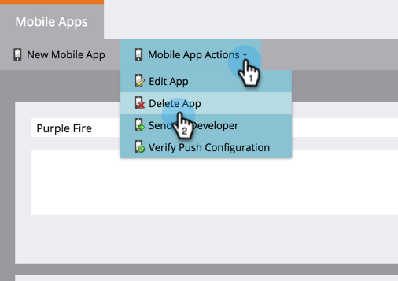

# Delete Mobile App {#delete-mobile-app}

1. Click **Admin**.

   

1. Select **Mobile Apps**.

   

1. Select the desired mobile app.

   

1. Click **Mobile App Actions** and select **Delete App**.

   

1. Confirm by clicking **Delete**.

   

Ta-da! Push notification can no longer be sent from this mobile app.
