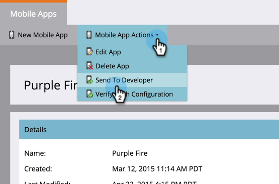
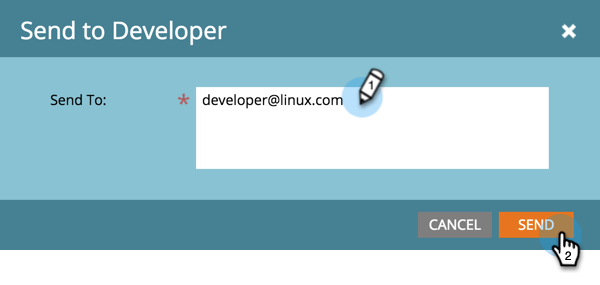

# Send SDK Code to a Developer {#send-sdk-code-to-a-developer}

Before you can create in-app messages or push notifications, you must have your developer set up and initialize the Mobile App SDK for the Android and iOS platforms.

* [Instructions for Android](https://developers.marketo.com/documentation/mobile/installation-instructions-on-android/)
* [Instructions for iOS](https://developers.marketo.com/documentation/mobile/installation-instructions-on-ios/)

## Send SDK Code to a Developer {#send-sdk-code-to-a-developer-1}

Sometimes, an admin needs to send some SDK code to a developer.

Here's how you do it.

1. Click **Admin**.

   

1. Select **Mobile Apps**.

   

1. Select the desired mobile app.

   

1. Click **Mobile App Actions** and select **Send to Developer**.

   

1. Enter an email address and click **Send**.

   

   The SDK code will now be sent to your developer.
