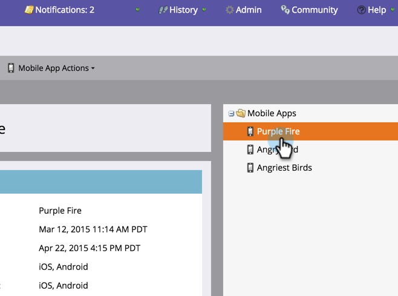
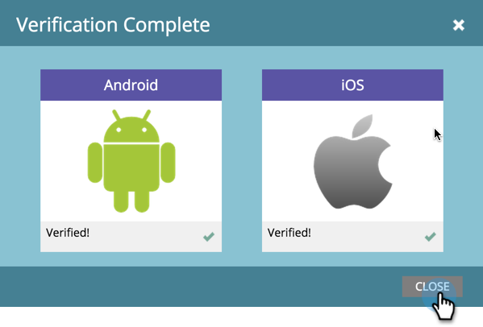

# Verify Push Configuration {#verify-push-configuration}

>[!PREREQUISITES]
>
>Your mobile developer must have added Marketo’s SDK code to your mobile app.

Verify push configuration to ensure everything is synced up nicely.

1. Click on **Admin**.

   

1. Select **Mobile Apps**.

   

   Select the desired mobile app.

   

   Click Mobile App Actions and select Verify Push Configuration.

   

   Confirm the desired platforms read verified and click CLOSE.

      All set! Now you can start sending push notifications 

>[!NOTE]
>
>**Related Articles**
>
>* [Create a Push Notification](../../../product-docs/mobile-marketing/push-notifications/create-a-push-notification.md)
>

