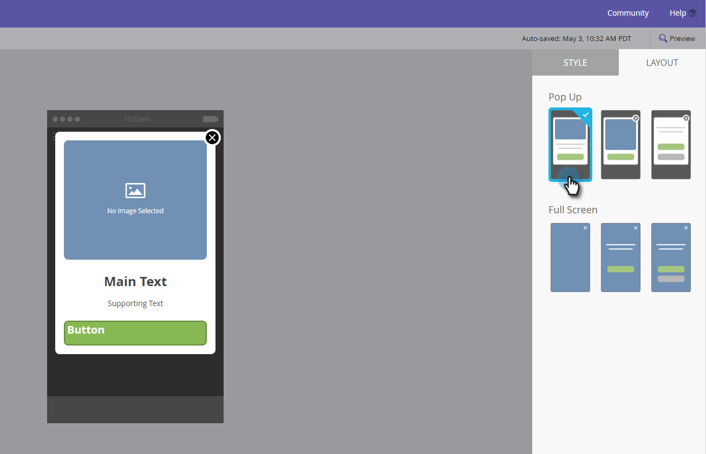

# Add In-App Message Images {#add-in-app-message-images}

Here's where you choose and customize your in-app message images.

1. Select the in-app message and click **Edit Draft**.

   

1. Choose one of the six templates on the Layout tab. There are three Pop Up and three Full Screen choices.

   >[!TIP]
   >
   >What's the difference between the templates? See [Choose a Layout for Your In-App Message](/help/marketo/product-docs/mobile-marketing/in-app-messages/creating-in-app-messages/choose-a-layout-for-your-in-app-message.md) before you get started.

   

1. Click the **Style** tab and click on the image area of the template.

   

1. Click **Select Image**.

   

1. Select your image from the Design Studio and click **Select**.

   

   >[!NOTE]
   >
   >Image size is limited to 1440 x 2560 px and 5MB.

1. Change your mind and want to use a different image? No problem. Click the **X** next to the image filename.

   

1. Click **Remove**. Now, you can pick another one.

   

1. With your desired image in place, in Image Properties, select a button to fit the image by Height, Width or Both.

   

1. Optionally, apply an image border. The default setting is **Off**. First, select color by clicking it or entering the Hex or RGB numbers on the color picker.

   

1. Click the arrows to change the border width, in pixels. You'll see it change on the image.

   

1. Select a corner radius using the slider. Select a position from left to right: 0, 4, 8, 12, or 16 pixels. The 8-pixel (center) selection is the default.

   

1. Select a margin (on or off). **On** is the default setting.

   

1. Check the box to define an image tap action.

   

1. There's a separate action for each platform (see Note).

   

1. Click each drop-down to display the options. Select one.

   

   >[!NOTE]
   >
   >For tap actions for images, buttons, or backgrounds, you can set up different actions for Apple and Android platforms. For example, deep links are handled differently for Apple and Android. If your message is going only to one platform or the other, leave the other one in the default setting or select **None**.

Great work! Now, it's time to [create the text for your in-app message](/help/marketo/product-docs/mobile-marketing/in-app-messages/creating-in-app-messages/create-in-app-message-text.md).

>[!MORELIKETHIS]
>
>* [Understanding In-App Messages](/help/marketo/product-docs/mobile-marketing/in-app-messages/understanding-in-app-messages.md)
>* [Choose a Layout for Your In-App Message](/help/marketo/product-docs/mobile-marketing/in-app-messages/creating-in-app-messages/choose-a-layout-for-your-in-app-message.md)
