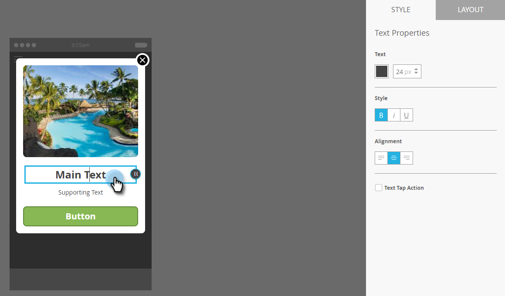
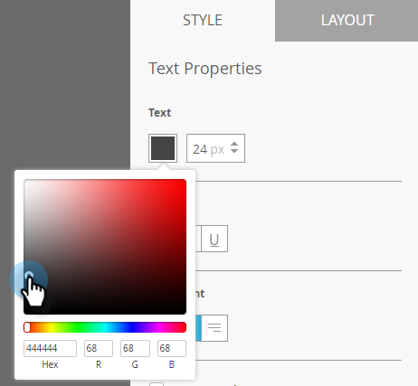

# Create In-App Message Text {#create-in-app-message-text}

Click the text area to work on your text style and content.

1. Click the Main Text to edit inline.

   

1. Choose the text color by clicking it or entering the Hex or RGB numbers on the color picker.

   

1. Click the arrows to select a text size.

   

   >[!CAUTION]
   >
   >Too large a text size may push your content past the maximum three visible lines of text.

1. Choose an optional type style, for emphasis: **Bold**, _Italic_, or Underline.

   

1. Choose text alignment: Left, Centered, Right. Centered is the default.

   

   >[!NOTE]
   >
   >The text font that's rendered in the ad is the standard one for each platform: Helvetica for Apple and Roboto for Android

1. Check the box to select **[!UICONTROL Text Tap action]**.

   

1. Select tap action for each platform: Apple or Android.

   

   >[!NOTE]
   >
   >For tap actions, you can set up different actions for Apple and Android platforms. For example, deep links are handled differently for Apple and Android. If your message is going only to one platform or the other, you can leave the other one in the default setting or select [!UICONTROL None].

1. Click the Supporting Text to edit it inline. It works the same way as editing the Main text, but the default text size is smaller.

   

1. For either the Main or Supporting text, click the Token icon to add a token.

   

1. Select a My Token from the drop-down, add a default value, and click **[!UICONTROL Insert]**.

   

   >[!NOTE]
   >
   >Only My Tokens are available as options. If no My Tokens have been set up in the program, the [!UICONTROL Token] drop-down will be empty.

   >[!TIP]
   >
   >Be sure to consider the length of characters that a token will resolve to when viewed by your audience. Leave enough space to account for potentially longer values, to prevent them from being cut off.

   Any changes you make to tokens used in an approved in-app message program will not take effect in the in-app message until the program is paused and then resumed.

You're golden. Next, you need to [set up your in-app message button](/help/marketo/product-docs/mobile-marketing/in-app-messages/creating-in-app-messages/set-up-the-in-app-message-button.md).

>[!MORELIKETHIS]
>
>* [Understanding In-App Messages](/help/marketo/product-docs/mobile-marketing/in-app-messages/understanding-in-app-messages.md)
>* [Choose a Layout for Your In-App Message](/help/marketo/product-docs/mobile-marketing/in-app-messages/creating-in-app-messages/choose-a-layout-for-your-in-app-message.md)
