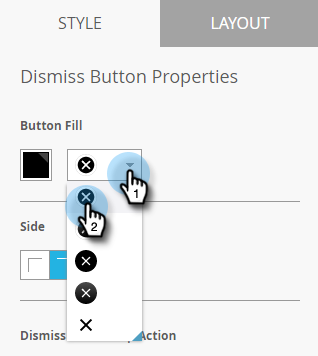
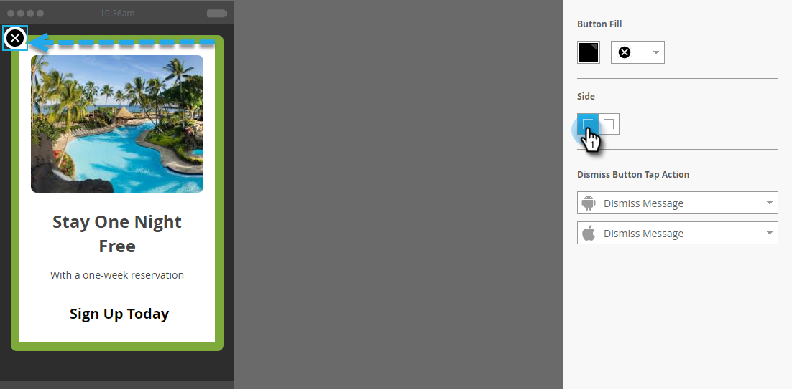
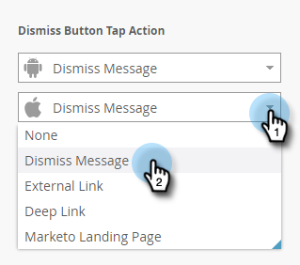
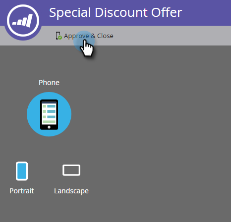

# Set Up the Dismiss Button and Approve the Message {#set-up-the-dismiss-button-and-approve-the-message}

## Configure Dismiss Button Properties  {#configure-dismiss-button-properties}

The Dismiss button has many options to let you configure it the way you want.

1. In the editor, click the Dismiss button.

   

1. If you want to change the button color, click the color selection square. Select a color by clicking it or entering the Hex or RGB numbers on the color picker. Black is the default.

   

1. Select a button design from the drop-down. Round buttons include a full color and a gradient option.

   

   >[!CAUTION]
   >
   >The button color may display as a white X on a white background when you select a different design from the drop-down. If so, simply select black or another color in the color selection square to make the white X visible.

1. You can click the left corner button to move the dismiss button to the left (right side is the default).

   

1. Click the drop-down for each platform and select a tap action for the Dismiss button.

   

   >[!NOTE]
   >
   >You must give the Dismiss button a tap action, so there's no check box to enable it. Dismiss Message is the default (and obvious) choice.

## Wrap it Up {#wrap-it-up}

All of your selections for the graphics, text, and buttons have been auto saved. Now, you're ready to finish the job.

1. To preview your in-app message, click the **Message Actions** drop-down and select **Preview**.

   

1. Preview the in-app message on phone or tablet to make sure it displays correctly.

   

1. If you're happy with the in-app message, click **Approve & Close**.

   

   >[!NOTE]
   >
   >You can also select **Approve & Close** directly from the Message Actions drop-down (see step 1), but why not preview the message first, just to be safe?

1. To close the editor without approving, simply close the tab. It's auto-saved, so you can return and approve it later.

   

So many choices, but now you've got a great-looking in-app message, ready to go!

Now it's time to [send your message](/help/marketo/product-docs/mobile-marketing/in-app-messages/sending-your-in-app-message/send-your-in-app-message.md).

>[!MORELIKETHIS]
>
>* [Understanding In-App Messages](/help/marketo/product-docs/mobile-marketing/in-app-messages/understanding-in-app-messages.md)
>* [Choose a Layout for Your In-App Message](/help/marketo/product-docs/mobile-marketing/in-app-messages/creating-in-app-messages/choose-a-layout-for-your-in-app-message.md)
