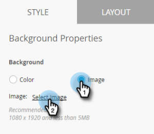
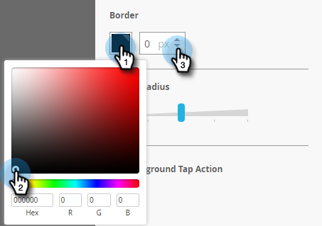
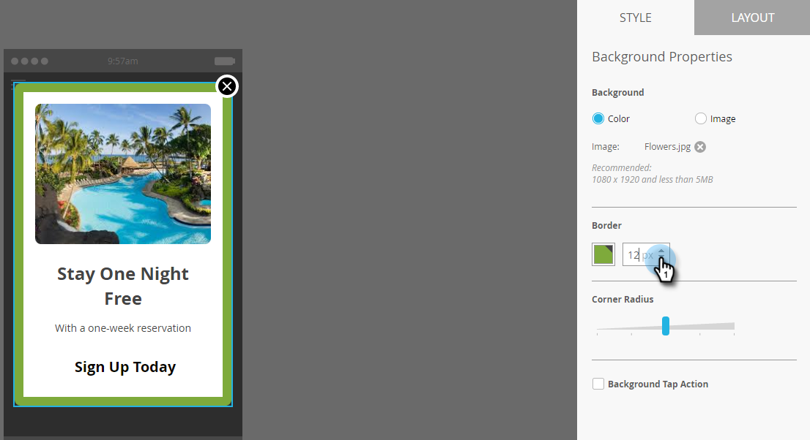

# Set Up the In-App Message Background {#set-up-the-in-app-message-background}

Selecting a message background is an important step in finishing up your in-app message.

>[!TIP]
>
>For background images, textures and gradients typically work best.

1. In the editor, click the background area.

   

1. To set a color, click **Color**, then the color selection square. Select the color by clicking it or entering the Hex or RGB codes on the color picker.

   

   >[!NOTE]
   >
   >Plain white, the default, is usually a winner.

1. If you want to use a background, click **Image** and then the **Select Image** link.

   

1. Choose from files uploaded to the the Design Studio. Click **Select**.

   

   >[!NOTE]
   >
   >Image size is limited to 1440 x 2560 px and 5MB.

1. Evaluate the results. Oops-maybe a plain color, texture, or gradient will work better!

   

1. Apply an optional image border. The default setting is **Off**. First, select the color by clicking it or entering the Hex or RGB numbers on the color picker.

   

1. Click the arrows to vary the border width. This 12-pixel-wide green border changes the look of the in-app message.

   

1. Select a corner radius using the slider. Select a position from left to right: 0, 4, 8, 12, or 16 pixels. The 8-pixel (center) selection is the default.

   

1. Check the box to set the background tap action (off by default).

   

   >[!NOTE]
   >
   >For tap actions for backgrounds, you can set up different actions for Apple and Android platforms. For example, deep links are handled differently for Apple and Android. If your message is going only to one platform or the other, leave the other one in the default setting or select **None**.

   [set up the Dismiss button](set-up-the-dismiss-button-and-approve-the-message.md)

   >[!MORELIKETHIS]
   >
   >
   >    
   >    
   >    * [Understanding In-App Messages](../../../../product-docs/mobile-marketing/in-app-messages/understanding-in-app-messages.md)
   >    * [Send an In-App Message](https://docs.marketo.com/pages/viewpage.action?pageid=10617378)
   >    * [Choose a Layout for Your In-App Message](choose-a-layout-for-your-in-app-message.md)
   >    
   >

To finish the job, your last step is to . 