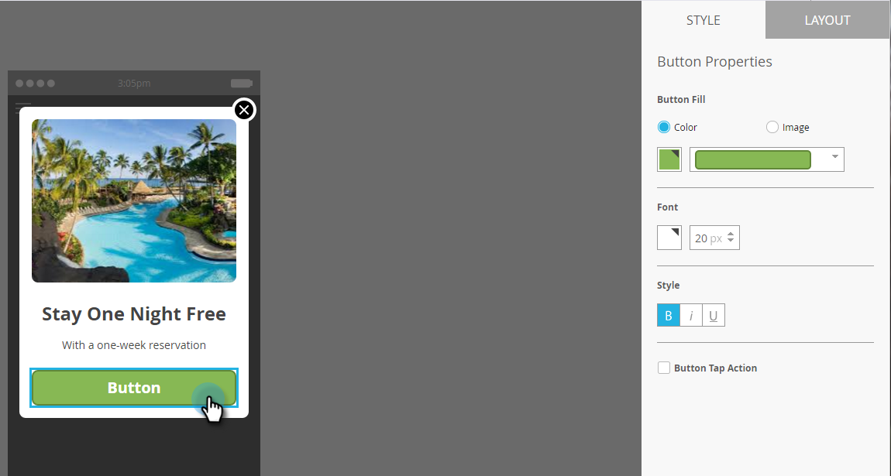
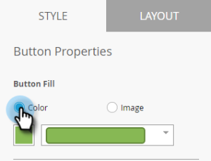
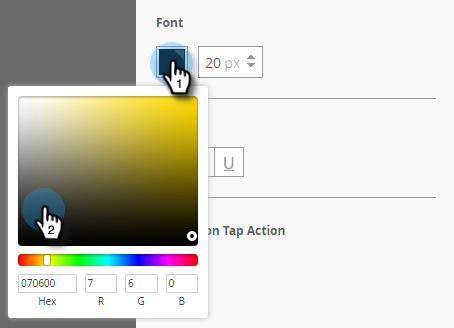
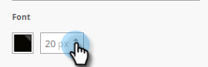
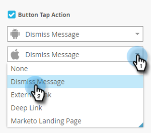

# Set Up the In-App Message Button {#set-up-the-in-app-message-button}

You can use the default button design, modify it, or upload your own custom button image.

1. Click the button to open the [!UICONTROL Style] tab for editing.

   

1. To change the color for the standard button, click the **[!UICONTROL Color]** button.

   

1. Click the color selection square and select the button color by clicking it or entering it the Hex or RGB numbers on the color picker.

   

1. Select a shape in the drop-down. Standard shape choices include sharp corners, round corners, and gradients.

   

1. If you want to use your own image for a button, click the **[!UICONTROL Image]** button, and click **[!UICONTROL Select Image]**.

   

1. Choose the image and click **[!UICONTROL Select]**.

   

   >[!TIP]
   >
   >When placing a custom image for the button, consider clearing the placeholder text laid over it if your image includes text already.

1. Click the color selection square and then select the font color by clicking it or entering Hex or RGB numbers on the color picker.

   

1. Click the arrows to choose the font size.

   

1. Choose font style for emphasis: **Bold**, _Italic_, or Underline.

   

1. Click the button text to edit it inline.

   

1. Check the box to set the button tap action.

   

1. Click the drop-down for each platform and select a tap action.

   

   >[!NOTE]
   >
   >The button always has a tap action, so the Tap Action checkbox is automatically selected, with the default message "[!UICONTROL Dismiss Message]".

Almost there. Your last step is to [configure your in-app message background and dismiss button](/help/marketo/product-docs/mobile-marketing/in-app-messages/creating-in-app-messages/set-up-the-in-app-message-background.md).

>[!MORELIKETHIS]
>
>* [Understanding In-App Messages](/help/marketo/product-docs/mobile-marketing/in-app-messages/understanding-in-app-messages.md)
>* [Choose a Layout for Your [!UICONTROL In-App Message]](/help/marketo/product-docs/mobile-marketing/in-app-messages/creating-in-app-messages/choose-a-layout-for-your-in-app-message.md)
