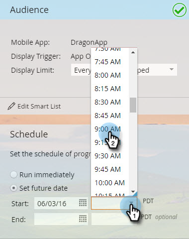
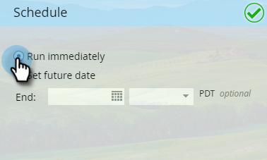

# Schedule Your In-App Message {#schedule-your-in-app-message}

Send your message now or schedule it for later.

1. To schedule an in-app message, select** Set future date** and choose a start date from the drop-down calendar.

   

1. Select a start time from the drop-down.

   

1. The End Date and time are optional; select them from the drop-downs.

   

1. Or, to run the program right now, select **Run Immediately**. The Start Date fields disappear.

   

   Easy. Last but not least is the [Approval](approve-your-in-app-message.md) step.

