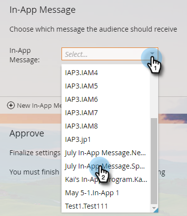

# Select Your In-App Message {#select-your-in-app-message}

Here's where you select the message you created to use in the program.

1. Select your in-app message from the drop-down.

   

   >[!NOTE]
   >
   >All messages are available to select, no matter where they live. Marketo appends the parent name to each one, to be sure each file receives a unique name.

1. After you've selected the message, it's ready. You can edit or preview it.

   

   >[!TIP]
   >
   >To select a different message, delete it in the [!UICONTROL In-App Message] field. Then, the [!UICONTROL New In-App Message] link comes back. Click it and select a different message.

You're right on track. Time to [schedule the send](/help/marketo/product-docs/mobile-marketing/in-app-messages/sending-your-in-app-message/schedule-your-in-app-message.md).
