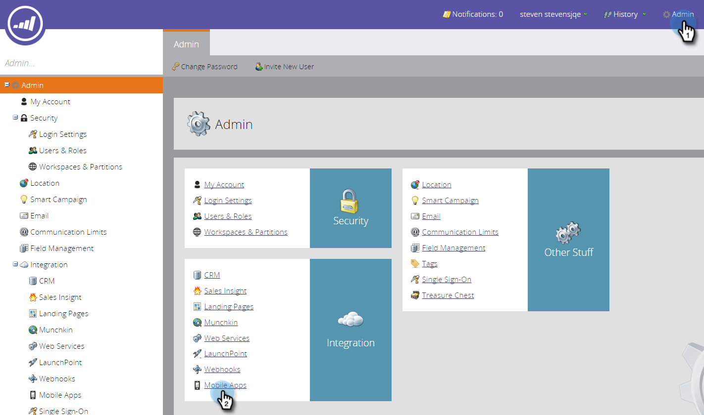
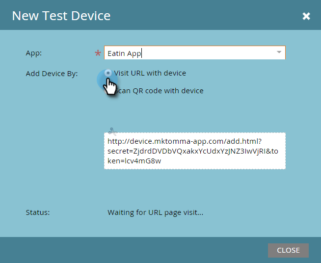
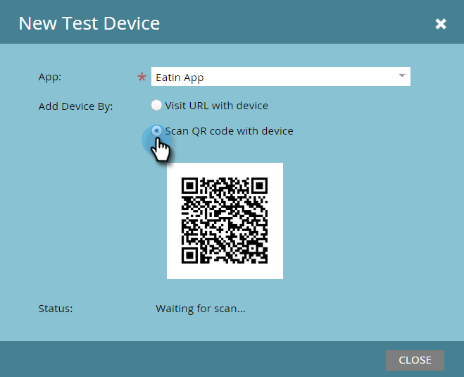
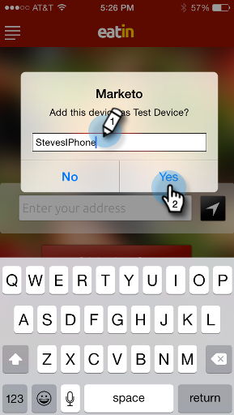
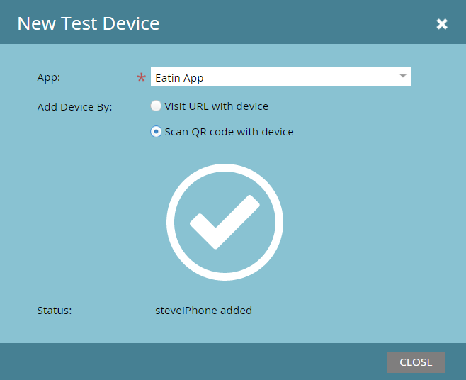

# Adding a New Test Device {#adding-a-new-test-device}

It's easy to add a new test device to push notifications to.

>[!NOTE]
>
>**Admin Permissions Required**

1. Click **[!UICONTROL Admin]** and then the **[!UICONTROL Mobile Apps]** link.

   

1. Click the **[!UICONTROL Test Devices]** tab and **[!UICONTROL New Test Device]**.

   

1. Select your app.

   

1. You have two ways to connect your device to the app.

   With the first option, just copy the URL from the field and send it in an email or text message to your device. From the device, tap the URL.

   

   Or, with second option, click the second button and scan the QR Code with your device.

   

1. The app opens. Name the device and tap **[!UICONTROL Yes]**.

   

   Success!

   

1. The Status updates to show the device is added. Congratulations!

   
