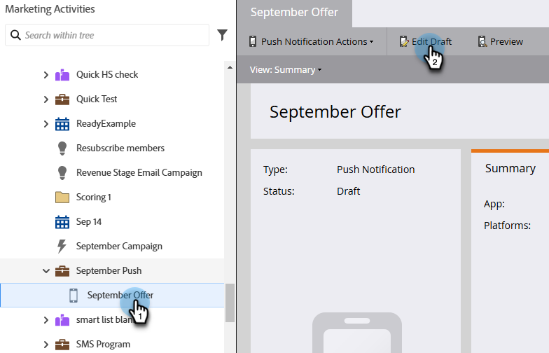
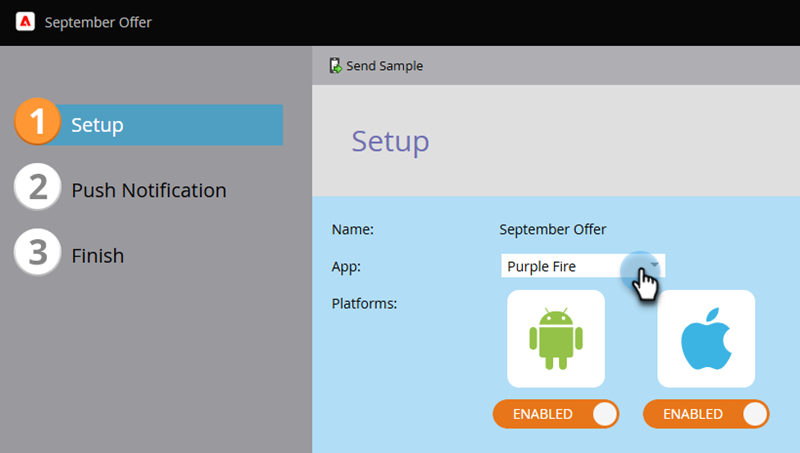
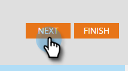
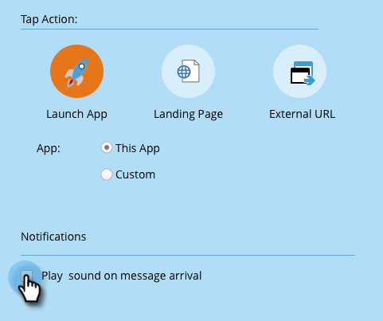
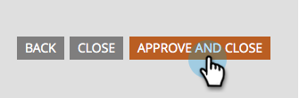

# Configure Mobile Push Notification {#configure-mobile-push-notification}

1. Go to the **[!UICONTROL Marketing Activities]** area.

   

1. Select your push asset and click **[!UICONTROL Edit Draft]**.

   

1. In **Setup**, select your desired app. Android and Apple platforms are enabled by default.

   

   >[!NOTE]
   >
   >If your Push message applies to only one platform (e.g., iOS), you can exclude the other platform by manually sliding its selector to **Disabled**.

1. Click **[!UICONTROL Next]**.

   

1. Enter message text or select the token icon to add tokens (in this editor tokens are formatted [as they usually are](/help/marketo/product-docs/demand-generation/landing-pages/personalizing-landing-pages/tokens-overview.md) - you can use multiple tokens). Select a **Tap Action**.

   

   >[!NOTE]
   >
   >If a platform is enabled, it appears on the left side of the phone screen display. It displays in color when it's selected.

   >[!NOTE]
   >
   >There are three types of [!UICONTROL Tap Actions]:
   >
   >**Launch App** - **This App** opens the home page of your app when the notification is tapped. **Custom** uses a deep link to open other areas of your app or any other app to which you have the link (see [Deep Link URIs](#deep-link-uris) below for details).
   >
   >**[!UICONTROL Landing Page]** - takes you to a specified Marketo landing page.
   >
   >**[!UICONTROL External URL]** - takes you to a non-Marketo landing page.

1. To insert a deep link for a custom tap action, select **Custom** and enter the [deep link URI](#deep-link-uris) in the field.

   

   >[!NOTE]
   >
   >Messages and Tap Actions will look the same on both platforms.

1. For iOS only, check the checkbox to tell the app to play a sound when the message arrives. Android plays the sound automatically.

   

1. Preview the other platform and click **[!UICONTROL Finish]**.

   

1. Click **[!UICONTROL Approve and Close]**.

   

Congratulations! Now the push notification is ready to be sent.

## Deep Link URIs {#deep-link-uris}

When subscribers click on a button in a push message, it can take them either to your app's home page or directly to a specific page within the app. A deep link is a unique reference to a specific page in your app, and looks a lot like a website link.

A deep link URI is made up of three parts: scheme name, path, and identifier. In the example below, "myappname" is the scheme. "products" is the path, and "purple-shirt" is the identifier. When the customer taps, they are taken specifically to the purple shirt item within your app's product pages.

That said, your app's deep link structure may be different from the above example. Your developer has many options in defining deep link URI's, so ask your developer to send you the URIs (links) for the pages you are interested in using. This will ensure that the URIs you enter in push messages point to the right places. Your developer can [find more information here](https://experienceleague.adobe.com/en/docs/marketo-developer/marketo/mobile/enabling-deep-links-in-your-app).

>[!MORELIKETHIS]
>
>[Send a Mobile Push Notification](/help/marketo/product-docs/mobile-marketing/push-notifications/send-a-mobile-push-notification.md)
