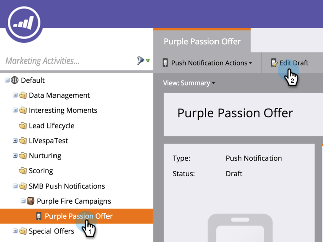

# Edit Mobile Push Notification {#edit-mobile-push-notification}

1. Go to the Marketing Activities area.

2. Select your Mobile App and click Edit Draft.

>[!NOTE]
>
>**Deep Dive**
>
>Learn more about [configuring push notifications](configure-mobile-push-notification.md) here.

