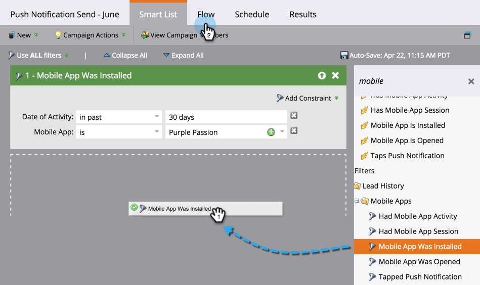
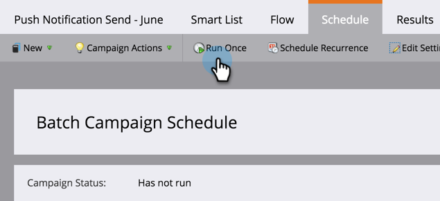
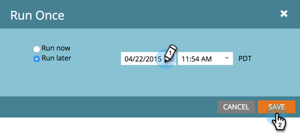

# Send a Mobile Push Notification {#send-a-mobile-push-notification}

Send a push notification to people using your mobile app.

>[!PREREQUISITES]
>
>* [Create a New Smart Campaign](/help/marketo/product-docs/core-marketo-concepts/smart-campaigns/creating-a-smart-campaign/create-a-new-smart-campaign.md)
>* [Create a Push Notification](/help/marketo/product-docs/mobile-marketing/push-notifications/create-a-push-notification.md)

1. Go to the **Marketing Activities** area.

   

1. Select your smart campaign and click **Smart List**.

   

1. Define your smart list then click **Flow**.

   

1. Select a push notification. Click **Schedule**.

   

   >[!NOTE]
   >
   >The push notification must be approved before it appears on the drop-down.

1. Click **Run Once**.

   

1. Choose a date and time. Click **Save**.

   

Sit back and wait for your push notification to go out.
