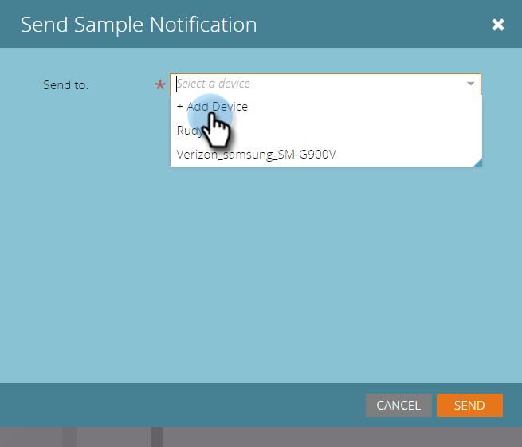
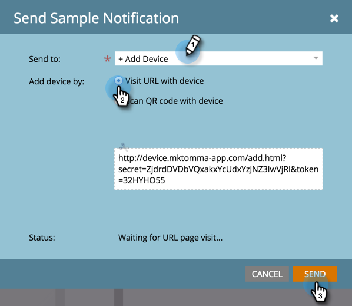

# Send a Push Notification Sample {#send-a-push-notification-sample}

You can send a sample to verify that your push notification is working correctly!

>[!NOTE]
>
>**Prerequisites**
>
>Make sure the app is installed on the device you're sending the sample to.

1. You can send a sample three ways:

   In the tree on the left, right click the push notification asset and click **Send Sample**.

   

   Or, from the Push Notification actions menu, click **Send Sample**.   
   

   Or, in the Push Notifications Editor, click **Send Sample**.

   

1. If you've already set up the test device you want to use, just select it from the list.

   

   Or, click **Add Device** to [add a new test device](adding-a-new-test-device.md) to send the sample to.

   

1. You have two ways to connect your device to the app.

   With the first option, click the **Visit URL with device** button, copy the URL from the field and send it in an email or text message to your device. From the device, tap the URL. When the status shows the connection, click **Send**.

   

   Or, with second option, click the **Scan QR code with device **button and scan the QR Code with your device. When the status shows the connection, click **Send**.

   

   >[!TIP]
   >
   >Have you successfully added a test device, but don’t see it listed in the **Send to** field? Check these to troubleshoot:
   >
   >    
   >    
   >    * Push notifications are turned on for the app associated with the push notification.
   >    
   >    
   >
   >    
   >    
   >    * The push notification is configured for your test device's platform. For example, if you just added an iPhone as a test device, make sure the push notification is enabled for iOS.
   >    
   >

Easy! 