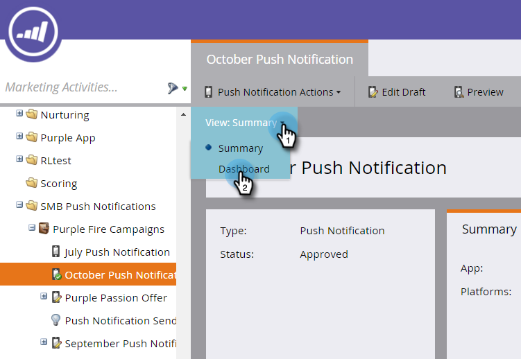
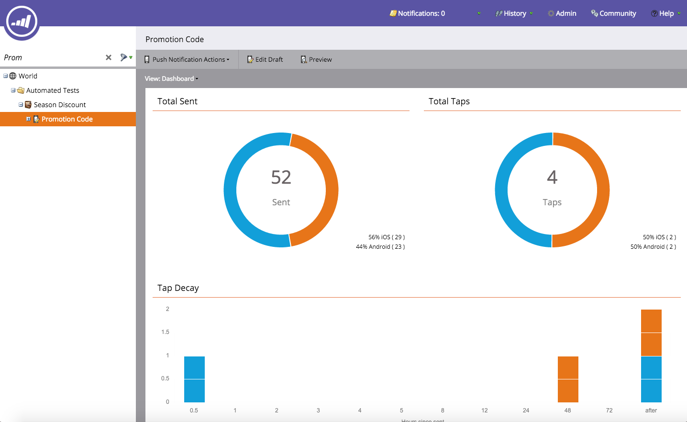

# View the Push Notification Dashboard {#view-the-push-notification-dashboard}

It's easy to see how your push notifications are doing.

1. Go to the **Marketing Activities** area.

   

1. Select your campaign.

   

1. Click **View: Summary** and select **Dashboard**.

   

1. You can view the Total Sent and Total Taps for iOS and Android in circle graphs. Scroll down to see Tap Decay in bar graphs.

   

   >[!NOTE]
   >
   >The _Sent_ metric may reflect more sends than the exact number of people to whom the the push notification was sent. That's because it's calculated based on the *number of devices* that qualify to receive your push. For example, if a single person has three devices, the dashboard registers three sends, not one.

   >[!MORELIKETHIS]
   >
   >* [Understanding Push Notifications](/help/marketo/product-docs/mobile-marketing/push-notifications/understanding-push-notifications.md)
   >* [Send a Mobile Push Notification](/help/marketo/product-docs/mobile-marketing/push-notifications/send-a-mobile-push-notification.md)
