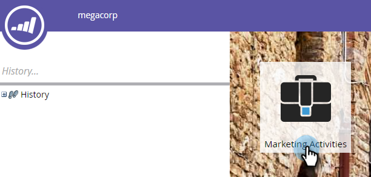
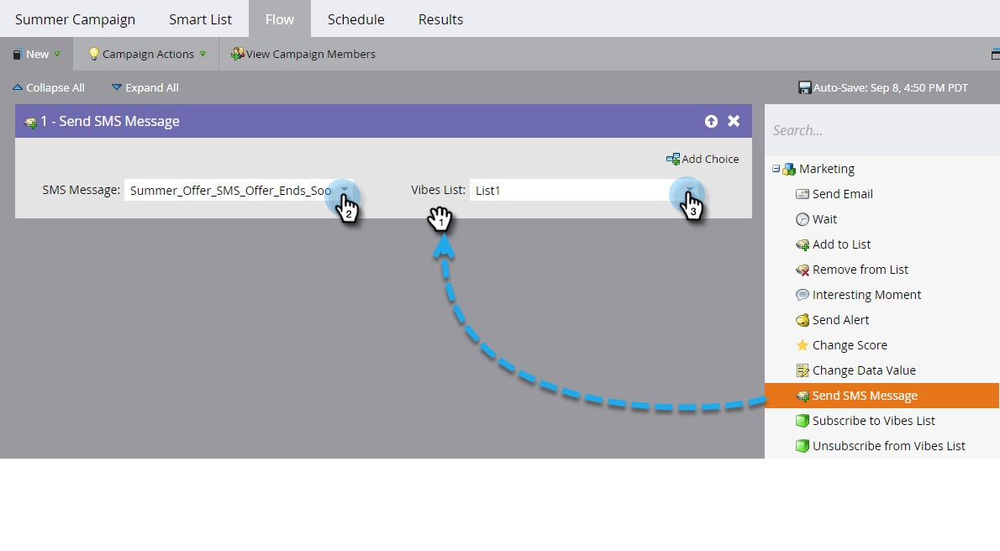

# Add a Flow Step for SMS {#add-a-flow-step-for-sms}

Marketo has three flow steps you can use in your SMS smart campaigns:

* **[!UICONTROL Send SMS Message]** - This flow action sends messages to people from the Marketo smartlist that are subscribed to a user-selected Vibes subscription list. It does not initiate the subscription process.
* **[!UICONTROL Subscribe to Vibes List]** - This flow action initiates the SMS subscription process via a user-selected Vibes Acquisition Campaign. Vibes then sends a confirmation message; the recipient must reply to it to complete the subscription process.
* **[!UICONTROL Unsubscribe from Vibes List]** - This flow action unsubscribes each person from a user-selected Vibes subscription list.

>[!NOTE]
>
>When sending SMS messages:
>
>* Marketo de-dupes by phone number. So if multiple people have the same phone number, only one person will receive the message.
>* Marketo will not send to people who are blocklisted or Marketing Suspended.

For general information on setting up flow steps, see [Add a Flow Step to a Smart Campaign](/help/marketo/product-docs/core-marketo-concepts/smart-campaigns/flow-actions/add-a-flow-step-to-a-smart-campaign.md).

Here are the basics for using SMS.

1. In My Marketo, click **[!UICONTROL Marketing Activities]**.

   

1. Find the smart campaign you want to add the SMS flow to. Click the **[!UICONTROL Flow]** tab.

   

1. Drag over the flow, for example, **[!UICONTROL Send SMS Message]**. Select the [!UICONTROL SMS Message] and the [!UICONTROL Vibes List] from the drop-downs.

   

   >[!NOTE]
   >
   >The [!UICONTROL Vibes List] selector acts as a further filter to the audience already identified in the smart list to target only those leads who belong to that Vibes list.
   >
   >The **[!UICONTROL Subscribe to Vibes List]** and **[!UICONTROL Unsubscribe from Vibes List]** flows have different requirements. For **Subscribe**, you must select the Vibes list and the Vibes acquisition campaign. For **Unsubscribe**, only the Vibes list is required.
