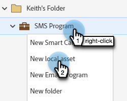
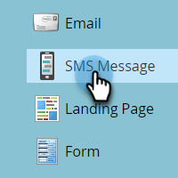
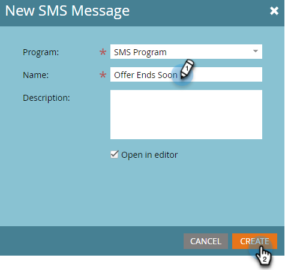
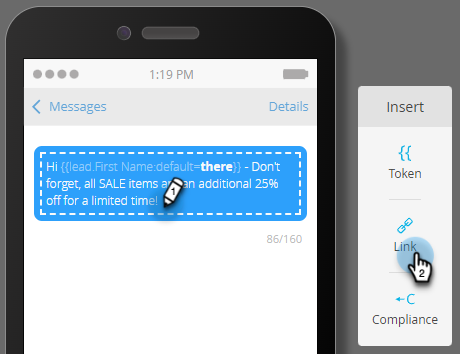

# Create a Vibes SMS Message {#create-a-vibes-sms-message}

Here's how to create a Vibes SMS message.

>[!AVAILABILITY]
>
>This feature is available as an add-on for your Adobe Marketo Engage Account. In order for it to be provisioned properly, it must be purchased through Adobe. Please contact the Adobe Account Team (your Account Manager) for details.

1. Go to **[!UICONTROL Marketing Activities]**.

   

1. Right-click on the desired program and select **[!UICONTROL New Local Asset]**.

   

1. Select **SMS Message**.

   

1. Enter a name and an optional description for the new SMS message and click **Create**.

   

1. In the editor, click inside the blue bubble and begin entering text.

   

   >[!NOTE]
   >
   >The character limit for an SMS message is 160 characters using the standard ASCII character set. If you exceed 160 characters, your message will be split based on total character count.

1. To add a token in your message, write a quick greeting and click **Token**.

   

   >[!NOTE]
   >
   >Adding a token may cause the message to exceed the character limit. The message would then split, creating an additional message.

   >[!IMPORTANT]
   >
   >SMS Compliance: All outbound SMS messages must include the Brand Name or Program description. HELP and STOP instructions should be provided at least once per month per subscriber for recurring message programs.

1. Select the desired **Token**, enter an optional **Default Value**, and click **Create**.

   

1. To add a link, select where in the message you want it to appear and click **Link**.

   

1. Select a link type. Marketo Landing Page is the default. If you go with that, click the Landing Page drop-down and select the desired page. Click **Insert** when done.

   

   >[!NOTE]
   >
   >The two tracking links are selected by default. Unchecking just Include mkt_tok will still allow the link to be tracked, but after redirect, the destination URL will not include the mkt_tok query string parameter. This parameter is used by Marketo Landing Pages and Munchkin to ensure proper tracking of person activities (like when a person opts out).

1. If you want to use an external URL instead, select **External URL**, enter/paste the URL, and click **Insert**.

   

   >[!NOTE]
   >
   >When keeping "Track Link" selected, Marketo will automatically modify the URL for tracking purposes. If you opt to disable tracking, the URL will show in the message unchanged (e.g., `www.adobe.com`).

   >[!CAUTION]
   >
   >It is recommended to _not_ use URL shorteners (e.g., Bitly), as the carriers may flag your message as spam. 

1. The link displays in the message.

   

   >[!NOTE]
   >
   >Marketo displays a link preview of the branded tracking domain. If you clear the mkt_tok link checkbox, the link is changed. 

If you insert more than 160 characters, the editor breaks your SMS into sections. There is an overall limit of 900 characters per message. If you exceed that, the message will be truncated upon delivery.
