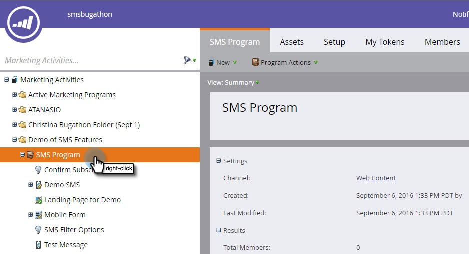
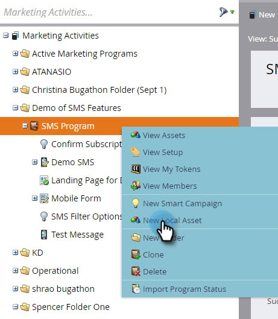
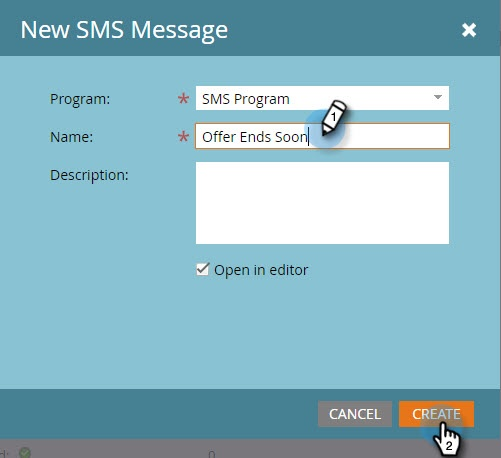
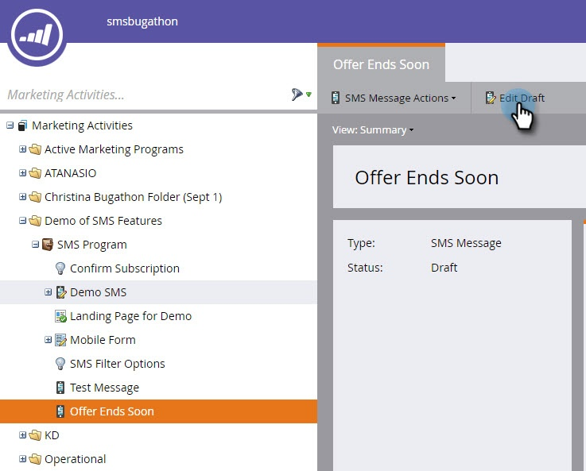
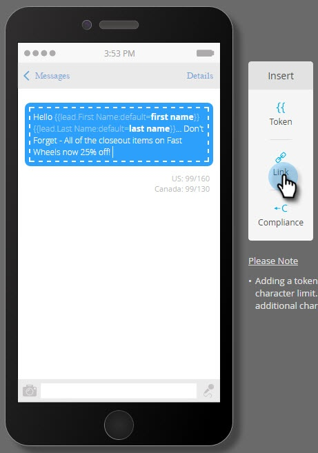
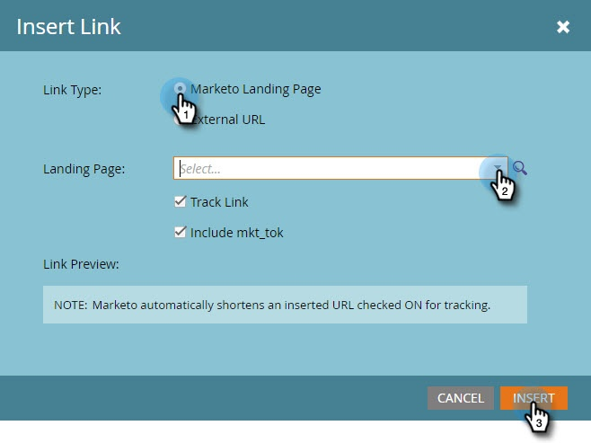
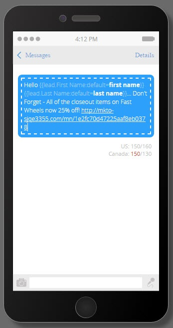
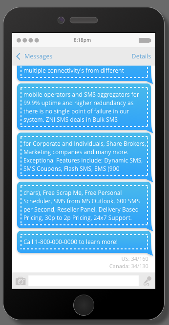

# Create a Vibes SMS Message {#create-a-vibes-sms-message}

Here's how to create a Vibes SMS message.

>[!AVAILABILITY]
>
>This feature is available as an add-on for your Marketo Engage Account. In order for it to be provisioned properly, it must purchased through Adobe. Please contact your Adobe Customer Success Manager for details.

>[!NOTE]
>
>SMS text messaging is not HIPAA compliant.

1. Go to **Marketing Activities** and right-click on a program.

   

1. Click **New Local Asset**.

   

   >[!TIP]
   >
   >Alternatively, you can click the **New** drop-down.

1. Click **SMS Message**.

   

1. Enter a name and an optional description for the new SMS message and click **Create**.

   

1. Click **Edit Draft**.

   

1. In the message editor, click inside the blue bubble and begin entering text.

   

   >[!NOTE]
   >
   >US and Canada limits are different, at 160 and 130 characters respectively. If you exceed these character limits, your message could be split. While we show when you exceed the Canadian limit, the editor is optimized for US and splits the message based on the US limit.

1. Click **Token** in the Insert menu to add a token to your message.

   

   >[!NOTE]
   >
   >Adding a token may cause the message to exceed the character limit. The message then will split, resulting in additional charges.

1. Click **Link** in the Insert menu to add a link to your message.

   

1. Select a link type. Marketo Landing Page is the default. If you go with that, you need to select the landing page from the drop-down and click **Insert**.

   

   >[!NOTE]
   >
   >The two tracking links are selected by default.

1. If you want to use an external URL instead, click the **External URL** button and enter the URL in the URL field. Click **Insert**.

   

1. The link displays in the message.

   

   >[!NOTE]
   >
   >Marketo displays a link preview of the branded tracking domain. If you clear the mkt_tok link checkbox, the link is changed. Clear the Track Link checkbox too and the URL will be shortened to its basic length (for example, www.mygooglepage.com).

   

   >[!NOTE]
   >
   >Character count reflects only the characters contained in the lowest message.

If you insert more than the US limit, the editor breaks your message into sections. There is an absolute total limit of 900 characters. After reaching that limit, the message will be automatically truncated when it's sent to its audience.
