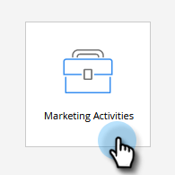
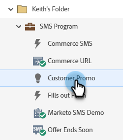
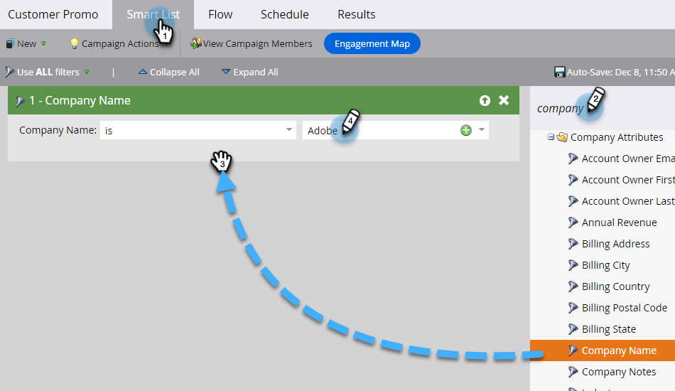
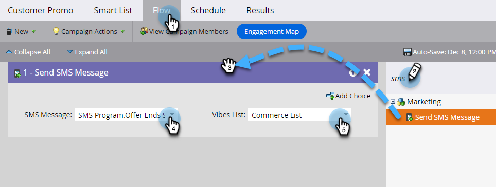
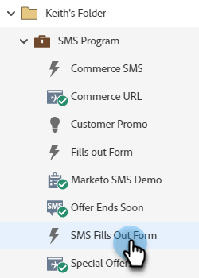
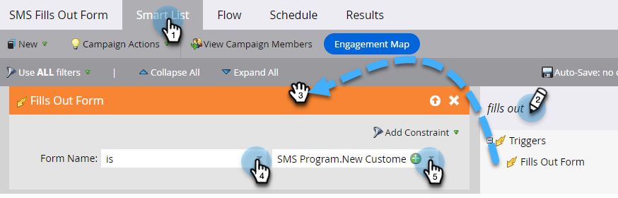
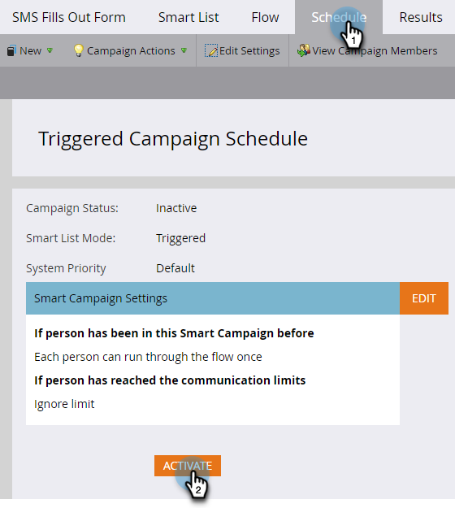

# Send an SMS Message {#send-a-vibes-sms-message}

You've [created your SMS message](/help/marketo/product-docs/mobile-marketing/vibes-sms-messages/create-an-sms-message.md){target="_blank"}, now it's time to send it. You can send it via Batch or Trigger Campaign.

>[!NOTE]
>
>When sending SMS messages:
>
>* Marketo Engage de-dupes by phone number. So, if multiple people have the same phone number, only one person will receive the message if they're a member of only one Vibes Subscription list. De-duping is done at the Vibes Subscription list level, not the Marketo program level.
>* Marketo will not send to people who are blocklisted or Marketing Suspended.
>* An SMS message will not send to anyone unsubscribed if they're not in the Vibes Mobile Database list.

## Send a Batch SMS {#send-a-batch-sms}

1. In My Marketo, click **Marketing Activities**.

   

1. Find and select the desired Smart Campaign.

   

1. Click the **Smart List** tab and define the audience for the SMS. In this example, we're sending to everyone in our Database that has "Adobe" listed as their company.

   

1. In the **Flow** tab, drag over **Send SMS Message**. Select the desired SMS Message and Vibes list from the drop-downs.

   

   >[!NOTE]
   >
   >The Vibes List selector acts as a further filter to the audience already identified in the Smart List to target only people who belong to that Vibes list.

1. Click the **Schedule** tab and schedule your SMS.

   

## Send a Trigger SMS {#send-a-trigger-sms}

1. In My Marketo, click **Marketing Activities**.

   

1. Find and select the desired Smart Campaign.

   

1. Click the **Smart List** tab, select the desired trigger and define its value. In this example, we're using **Fills Out Form**.

   

1. In the **Flow** tab, drag over **Send SMS Message**. Select the desired SMS Message and Vibes list from the drop-downs.

   

   >[!NOTE]
   >
   >The Vibes List selector acts as a further filter to the audience already identified in the Smart List to target only people who belong to that Vibes list.

1. Click the **Schedule** tab, then **Activate**.

   

>[!MORELIKETHIS]
>
>* [Create a Vibes Message](/help/marketo/product-docs/mobile-marketing/vibes-sms-messages/create-a-vibes-sms-message.md){target="_blank"}
>* [Using SMS Options in a Smart Campaign](/help/marketo/product-docs/mobile-marketing/vibes-sms-messages/using-sms-options-in-a-smart-campaign.md){target="_blank"}
