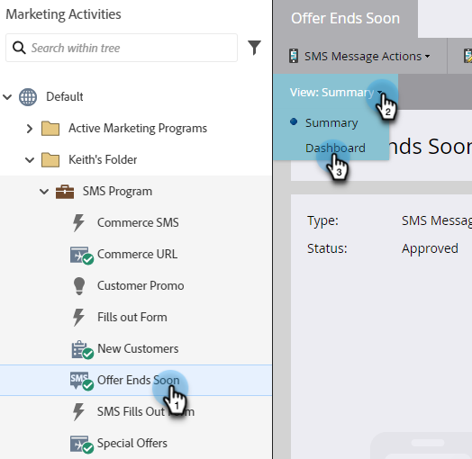
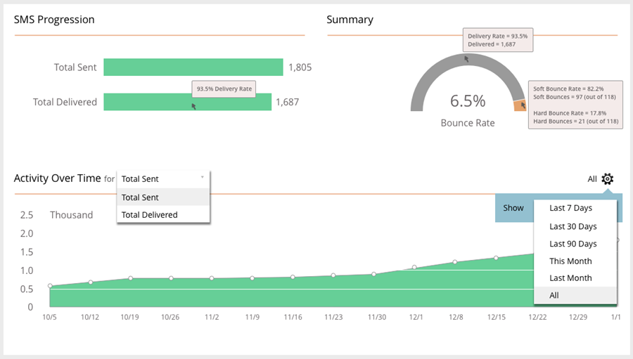

# SMS Reporting {#sms-reporting}

The SMS Message Dashboard provides useful reporting analytics on your messages.

## Access the Dashboard {#access-the-dashboard}

1. To view the reporting, select the desired SMS message. Click the **View** drop-down and select **Dashboard**.

   

1. The dashboard will appear.

   

## Dashboard Overview {#dashboard-overview}

### SMS Progression {#sms-progression} 

Displays total sent and total delivered. The amounts are at the right, and if you hover over a bar, the percentage is displayed.

   

### Summary {#summary}

Shows the calculated Bounce Rate as a percentage. Hover over the arching bar to view the delivery rate by amount and percentage. Hover over the orange Bounce Rate section of the bar to view the Soft and Hard Bounce Rate amounts/percentages.

   

### Activity Over Time {#activity-over-time}

Allows you to select Total Sent or Total Delivered. Select an appropriate range from the date range selector.

   
