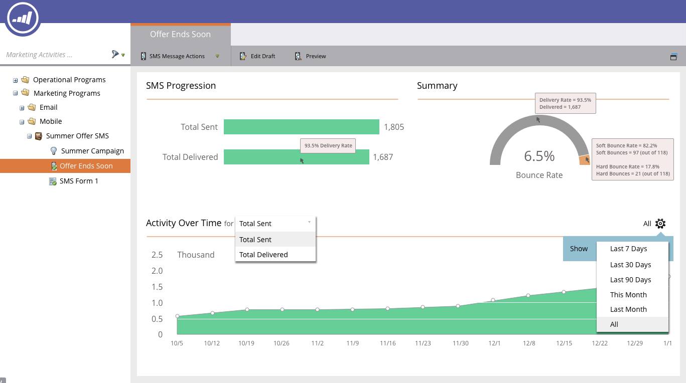
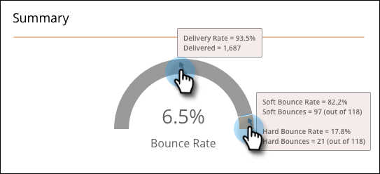
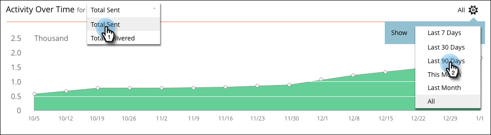

# The SMS Message Dashboard {#the-sms-message-dashboard}

The SMS Message Dashboard displays useful information about your SMS message.

The **[!UICONTROL SMS Progression]** graph displays total sent and total delivered. The amounts are at the right and if you hover over a bar, the percentage is displayed.

The **[!UICONTROL Summary]** graph shows the calculated Bounce Rate as a percentage. Hover over the arching bar to view the delivery rate by amount and percentage. Hover over the orange Bounce Rate section of the bar to view the [!UICONTROL Soft Bounce Rate] and [!UICONTROL Hard Bounce Rate] amounts and percentages.

The **[!UICONTROL Activity Over Time]** graph allows you to select [!UICONTROL Total Sent] or [!UICONTROL Total Delivered]. Select an appropriate range from the date range selector.

Clear as a bell!
