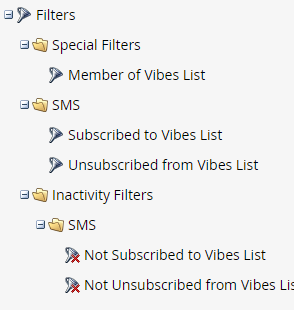

# Use SMS Options in Smart List Triggers and Filters {#use-sms-options-in-smart-list-triggers-and-filters}

NEW DOC

After you [create an SMS message](/help/marketo/product-docs/mobile-marketing/vibes-sms-messages/create-an-sms-message.md){target="_blank"}, you'll want to use Smart List triggers and filters within a Smart Campaign to get the benefits.

>[!PREREQUISITES]
>
>SMS triggers/filters only appear if the [Vibes service has been enabled](/help/marketo/product-docs/mobile-marketing/admin/add-vibes-as-a-launchpoint-service.md).

## SMS Triggers {#sms-triggers}

<table>
  <tr>
    <td></td>
    <td></td>
  </tr>
</table>

Here are a few examples:

The **SMS Message Bounces** trigger initiates a flow, such as sending an email, when an SMS message bounces.

The **Subscribes to Vibes List** trigger initiates a flow when a person subscribes.

The **Clicks Link in SMS Message** trigger initiates a flow when a person clicks on a link in the SMS message.

## SMS Filters {#sms-filters}

<table>
  <tr>
    <td></td>
    <td></td>
  </tr>
</table>

You can also use Vibes filters in Smart Lists. The **Subscribed to Vibes List** filter finds anyone who has *ever* subscribed to Vibes. This includes both unsubscribed and deleted people, even though deleted people are omitted from the flow. This filter is best suited for reporting.

By contrast, the **Member of Vibes List** filter finds _anyone_ currently subscribed to Vibes and is most suited for use in Smart Campaigns or lists.

>[!NOTE]
>
>All SMS filters includes the **Date of Activity** constraint by default.

After you set up Vibes triggers and filters in your Smart List, you can [define the flow](/help/marketo/product-docs/mobile-marketing/vibes-sms-messages/add-a-flow-step-for-sms.md).

>[!MORELIKETHIS]
>
>* [Send an SMS Message](/help/marketo/product-docs/mobile-marketing/vibes-sms-messages/send-an-sms-message.md)
>* [Define Smart List for Smart Campaign | Trigger](/help/marketo/product-docs/core-marketo-concepts/smart-campaigns/creating-a-smart-campaign/define-smart-list-for-smart-campaign-trigger.md)
>* [Find and Add Filters to a Smart List](/help/marketo/product-docs/core-marketo-concepts/smart-lists-and-static-lists/creating-a-smart-list/find-and-add-filters-to-a-smart-list.md)
