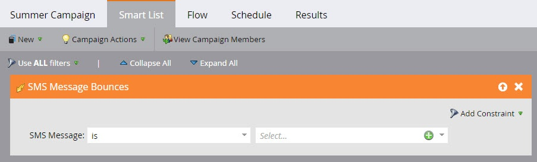
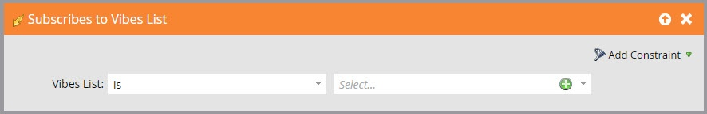
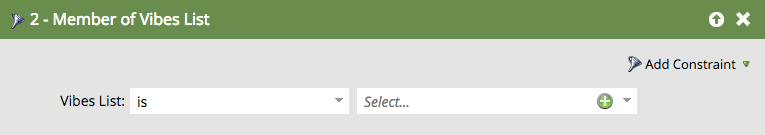

# Use Vibes SMS Messages in Smart List Triggers and Filters {#use-vibes-sms-messages-in-smart-list-triggers-and-filters}

After you [create a Vibes SMS message](create-a-vibes-sms-message.md), you'll want to use smart list triggers and filters within a smart campaign to get the benefits. Here's how.

1. In My Marketo, click **Marketing Activities**.

   

1. Choose a smart campaign in which you want to use your SMS asset. Drag over a trigger, such as the popular **Fills Out Form**.

   

## SMS Triggers {#sms-triggers}

There are other SMS triggers available. The SMS triggers appear only if Vibes service is enabled.

Here are a few examples. 

The SMS Message Bounces trigger initiates a flow, such as sending an email, when an SMS message bounces.

The **Subscribes to Vibes List** trigger initiates a flow when a person subscribes.

The** Clicks Link in SMS Message** trigger initiates a flow when a person clicks on a link in the SMS message.

## SMS Filters {#sms-filters}

You can also use Vibes filters in smart lists. The **Subscribed to Vibes List** filter finds anyone who has *ever* subscribed to Vibes. This includes both unsubscribed and deleted people, even though deleted people are omitted from the flow. This filter is best suited for reporting.

By contrast, the **Member of Vibes List **filter** **finds** **anyone** ***currently* subscribed to Vibes and is most suited for use in smart campaigns or lists.

>[!NOTE]
>
>All SMS filters includes the **Date of Activity** constraint by default.

After you set up Vibes triggers and filters in your smart list, you can [define the flow](add-a-flow-step-for-sms.md). 

>[!MORELIKETHIS]
>
>* [Define Smart List for Smart Campaign | Trigger](../../../product-docs/core-marketo-concepts/smart-campaigns/creating-a-smart-campaign/define-smart-list-for-smart-campaign-trigger.md)
>* [Find and Add Filters to a Smart List](../../../product-docs/core-marketo-concepts/smart-lists-and-static-lists/creating-a-smart-list/find-and-add-filters-to-a-smart-list.md)
>* [Add a Flow Step for SMS](add-a-flow-step-for-sms.md)
>

