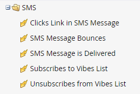
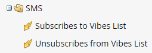
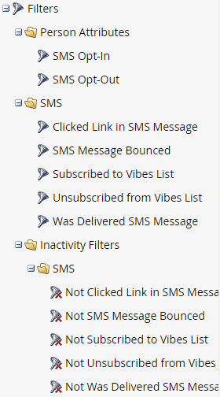
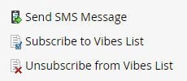

# Using SMS Options in a Smart Campaign {#using-sms-options-in-a-smart-campaign}

After you [create an SMS message](/help/marketo/product-docs/mobile-marketing/vibes-sms-messages/create-an-sms-message-2.md){target="_blank"}, you'll want to use Smart List triggers and filters within a Smart Campaign to get the benefits.

>[!NOTE]
>
>If you're looking to send an SMS message, we have a [specific article](/help/marketo/product-docs/mobile-marketing/vibes-sms-messages/send-an-sms-message.md) for that.

>[!PREREQUISITES]
>
>SMS triggers/filters only appear if the [Vibes service has been enabled](/help/marketo/product-docs/mobile-marketing/admin/add-vibes-as-a-launchpoint-service.md).

## SMS Triggers {#sms-triggers}

<table style="width:600px">
  <tr>
    <td style="width:50%"></td>
    <td style="width:50%"></td>
  </tr>
</table>

Here are a few examples:

The **SMS Message Bounces** trigger initiates a flow, such as sending an email, when an SMS message bounces.

The **Subscribes to Vibes List** trigger initiates a flow when a person subscribes.

The **Clicks Link in SMS Message** trigger initiates a flow when a person clicks on a link in the SMS message.

## SMS Filters {#sms-filters}

<table style="width:600px">
  <tr>
    <td style="width:50%"></td>
    <td style="width:50%"></td>
  </tr>
</table>

The **Subscribed to Vibes List** filter finds anyone who has *ever* subscribed to Vibes. This includes both unsubscribed and deleted people, even though deleted people are omitted from the flow. This filter is best suited for reporting.

By contrast, the **Member of Vibes List** filter finds _anyone_ currently subscribed to Vibes and is most suited for use in Smart Campaigns or lists.

>[!NOTE]
>
>All SMS filters include the **Date of Activity** constraint by default.

## SMS Flow Steps {#sms-flow-steps}

There are three SMS flow steps to choose from.

<table>
<tbody>
  <tr>
    <td style="width:20%"><b>Send SMS Message</b></td>
    <td>This flow action sends messages to people from the Marketo Smart List that are subscribed to a user opted-in Vibes subscription list. It does not initiate the subscription process. <a href="/help/marketo/product-docs/mobile-marketing/vibes-sms-messages/send-an-sms-message.md">Learn more</a>.</td>
  </tr>

  <tr>
    <td style="width:20%"><b>Subscribe to Vibes List</b></td>
    <td>This flow action initiates the SMS subscription process via a user-selected Vibes acquisition campaign. Vibes then sends a confirmation message, and the recipient must reply to it with "Y" within 24 hours to confirm opt-in. Once the user has opted in, they will become a member of your associated Vibes subscription list.</td>
  </tr>
  <tr>
    <td style="width:20%"><b>Unsubscribe from Vibes List</b></td>
    <td>This flow action unsubscribes each person from a user opted-in Vibes subscription list. When a user texts "STOP" to your code, their person record is updated to reflect they're no longer a member of the Vibes Subscription list.</td>
  </tr>
  </tbody>
</table>

   >[!NOTE]
   >
   >The **Subscribe to Vibes List** and **Unsubscribe from Vibes List** flows have different requirements. For **Subscribe**, you must select the Vibes list and the Vibes acquisition campaign. For **Unsubscribe**, only the Vibes list is required.

>[!MORELIKETHIS]
>
>* [Send an SMS Message](/help/marketo/product-docs/mobile-marketing/vibes-sms-messages/send-an-sms-message.md)
>* [Define Smart List for Smart Campaign | Trigger](/help/marketo/product-docs/core-marketo-concepts/smart-campaigns/creating-a-smart-campaign/define-smart-list-for-smart-campaign-trigger.md)
>* [Define Smart List for Smart Campaign | Batch](/help/marketo/product-docs/core-marketo-concepts/smart-campaigns/creating-a-smart-campaign/define-smart-list-for-smart-campaign-batch.md)
