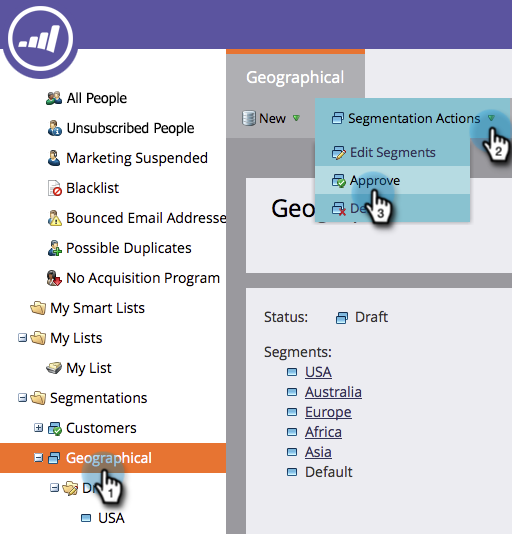
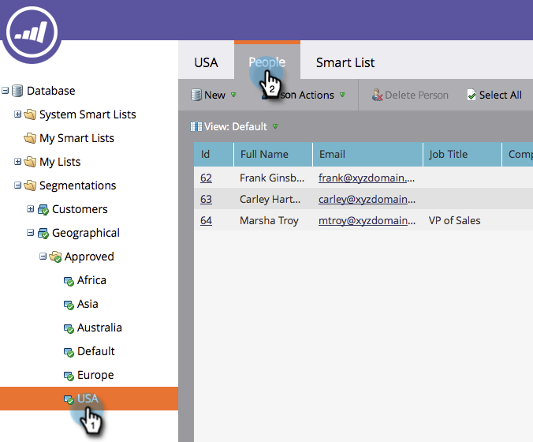

# Approve a Segmentation {#approve-a-segmentation}

A segmentation needs to be approved before it can used.

>[!NOTE]
>
>**FYI**
>
>Marketo is now standardizing language across all subscriptions, so you may see lead/leads in your subscription and person/people in docs.marketo.com. These terms mean the same thing; it does not affect article instructions. There are some other changes, too. [Learn more](http://docs.marketo.com/display/DOCS/Updates+to+Marketo+Terminology).

>[!NOTE]
>
>**Prerequisites**
>
>* [Create a Segmentation](create-a-segmentation.md)
>* [Define Segment Rules](define-segment-rules.md)
>

1. Go to the **Database**.

   

1. In the Segmentation click **Segmentation Actions**, and then **Approve**.

   

   >[!NOTE]
   >
   >The Status changes to Approving with a spinning wheel ( ) while the approval is in process.

   >[!CAUTION]
   >
   >Approval can take a few minutes to more than a day to complete, depending on the size of the database.

   ##### Once approved, the Status&nbsp;changes from Approving to Approved. {#once-approved-the-status-changes-from-approving-to-approved}

   

   >[!TIP]
   >
   >The number of people in each segment is shown in brackets next to the segment name.

1. The **People** tab in the **Segment** now shows the final list of people for the segment.

   

>[!CAUTION]
>
>The total number of segments you can create in a segmentation depends on the number and type of filters used and also on how complex the logic of your segments is. While you can create up to 100 segments using standard fields, using other types of filters can increase the complexity, and your segmentation might fail to approve. Some examples are: custom fields, member of list, lead owner fields, and revenue stages.
>
>If you get an error message during approval and require assistance in reducing the complexity of your segmentation, please contact [Marketo Support](http://docs.marketo.com/cdn-cgi/l/email-protection#45363035352a3731052824372e20312a6b262a28).

>[!NOTE]
>
>**Related Articles**
>
>* [Use Segment Filters in a Smart List](use-segment-filters-in-a-smart-list.md)
>

