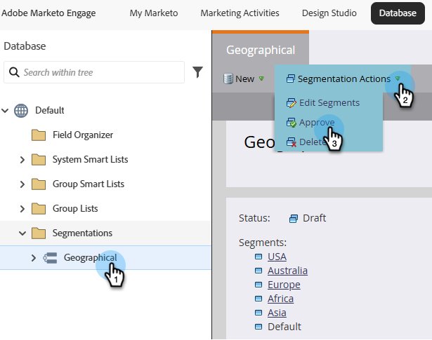
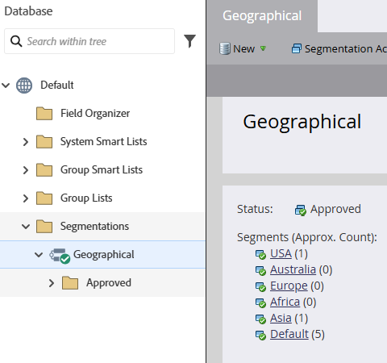
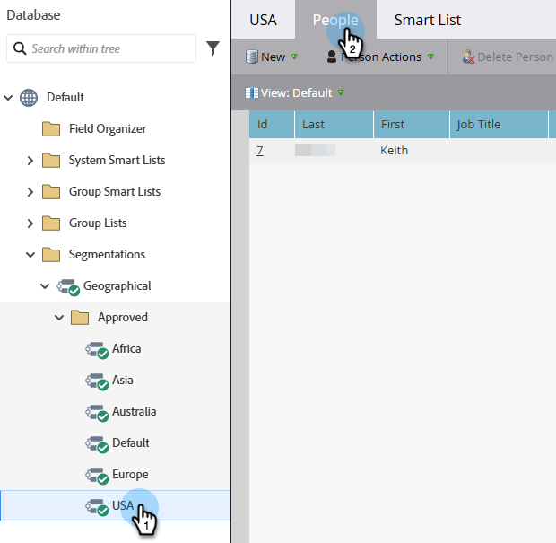

# Approve a Segmentation {#approve-a-segmentation}

A segmentation needs to be approved before it can be used.

>[!PREREQUISITES]
>
>* [Create a Segmentation](/help/marketo/product-docs/personalization/segmentation-and-snippets/segmentation/create-a-segmentation.md)
>* [Define Segment Rules](/help/marketo/product-docs/personalization/segmentation-and-snippets/segmentation/define-segment-rules.md)

>[!NOTE]
>
>A maximum of 20 Segmentations can be approved at a time.

1. Go to the **[!UICONTROL Database]**.

   

1. In the Segmentation click **[!UICONTROL Segmentation Actions]**, and then **[!UICONTROL Approve]**.

   

   >[!NOTE]
   >
   >The status changes to _Approving_ while the approval is in process.

   >[!CAUTION]
   >
   >Approval can take from a few minutes to a day or two to complete, depending on the size of the database.

1. Once approved, the [!UICONTROL Status] changes from [!UICONTROL Approving] to [!UICONTROL Approved].
   
   

   >[!TIP]
   >
   >The number of people in each segment is shown in brackets next to the segment name.

1. The **[!UICONTROL People]** tab in the **[!UICONTROL Segment]** now shows the final list of people for the segment.

   

>[!CAUTION]
>
>The total number of segments you can create in a segmentation depends on the number and type of filters used and also on how complex the logic of your segments is. While you can create up to 100 segments using standard fields, using other types of filters can increase the complexity, and your segmentation might fail to approve. Some examples are: custom fields, member of list, lead owner fields, and revenue stages.
>
>If you get an error message during approval and require assistance in reducing the complexity of your segmentation, please contact [Marketo Support](https://nation.marketo.com/t5/Support/ct-p/Support).

>[!MORELIKETHIS]
>
>[Use Segment Filters in a Smart List](/help/marketo/product-docs/personalization/segmentation-and-snippets/segmentation/use-segment-filters-in-a-smart-list.md)
