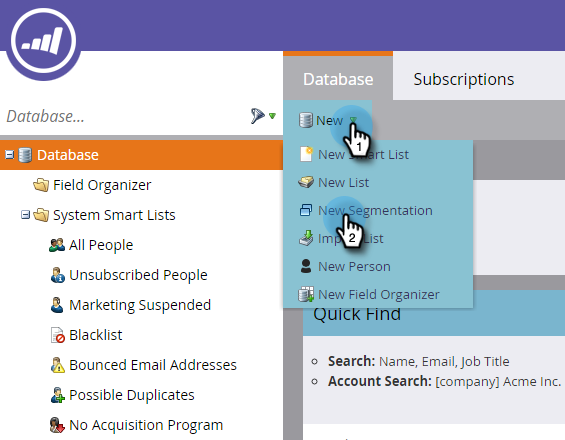
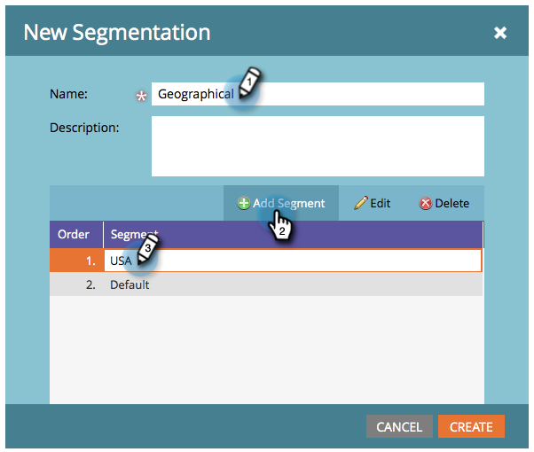
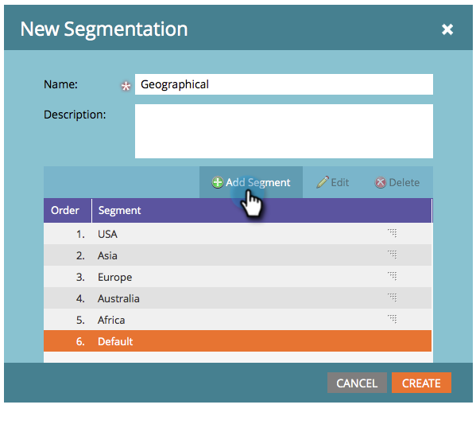

# Create a Segmentation {#create-a-segmentation}

Segmentation allows you to group people into distinct profiles for reporting and dynamic content. Here's how to create them.

>[!NOTE]
>
>**FYI**
>
>Marketo is now standardizing language across all subscriptions, so you may see lead/leads in your subscription and person/people in docs.marketo.com. These terms mean the same thing; it does not affect article instructions. There are some other changes, too. [Learn more](http://docs.marketo.com/display/DOCS/Updates+to+Marketo+Terminology).

1. Go to **Database**.

   

1. Click **New **and then&nbsp;**New Segmentation**.

   

   >[!TIP]
   >
   >You can create up to 20 segmentations.

1. Enter a **Name**, click on** Add** **Segment** and name it.

   

   >[!NOTE]
   >
   >Default cannot be moved, edited, or deleted.

1. Add as many segments as you want (up to 100).

   

   >[!CAUTION]
   >
   >The total number of segments you can create in a segmentation depends on the number and type of filters used and also on how complex the logic of your segments is. While you can create up to 100 segments using standard fields, using other types of filters can increase the complexity, and your segmentation might fail to approve. Some examples are: custom fields, member of list, lead owner fields, and revenue stages.
   >
   >
   >If you get an error message during approval and require assistance in reducing the complexity of your segmentation, please contact [Marketo Support](http://docs.marketo.com/cdn-cgi/l/email-protection#3e4d4b4e4e514c4a7e535f4c555b4a51105d5153).

1. Drag and drop the Segments around to change their order. Once done, click on **Create**.

   

   >[!NOTE]
   >
   >A person will qualify for the first matching segment in the [order](segmentation-order-priority.md) defined.

   >[!NOTE]
   >
   >**Reminder**
   >
   >
   >You need to define segment rules before you can use your Segmentation.

   >[!NOTE]
   >
   >**Related Articles**
   >
   >    
   >    
   >    * [Define Segment Rules](define-segment-rules.md)
   >    
   >

Congratulations! You are one step closer to using Dynamic Content. 