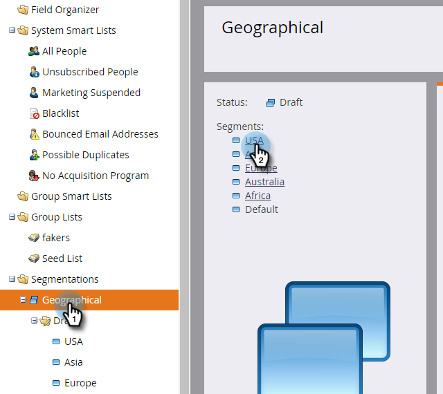
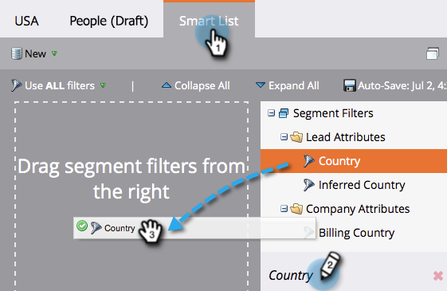
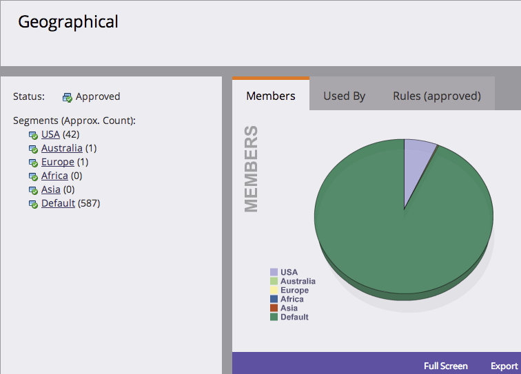

# Define Segment Rules {#define-segment-rules}

Defining Segment Rules allows you to categorize your people into different mutually exclusive groups.

>[!PREREQUISITES]
>
>[Create a Segmentation](/help/marketo/product-docs/personalization/segmentation-and-snippets/segmentation/create-a-segmentation.md)

1. Go to the **[!UICONTROL Database]**.

   

1. Select **[!UICONTROL Segmentations]** from the tree, then click a particular **Segment**.

   

1. Click **[!UICONTROL Smart List]** and add filters.

   

   >[!CAUTION]
   >
   >Segments currently do not support _In Past_ and _In Timeframe_  operators on filters. That's because segmentations only check for updates when a change data value is logged. These values are _not_ logged for things that change automatically, such as formula fields and dates. Additionally, date operators with relative date ranges are not supported as they are calculated at the time of segmentation approval, not at the time of a Change Data Value activity.

   >[!NOTE]
   >
   >The "SFDC Type" and "Microsoft Type" filters are currently not supported in segmentation smart lists.

1. Fill appropriate values for the filters.

   

   >[!CAUTION]
   >
   >Activity logging behavior for Account fields can impact qualification. Therefore, we advise against the use of Account fields when defining segment rules.

1. Click the **[!UICONTROL People (Draft)]** tab to view the people that may qualify to be a member of this segment.

   

1. Go to **[!UICONTROL Segmentation Actions]**. Click **[!UICONTROL Approve]**.

   

   >[!CAUTION]
   >
   >The total number of segments you can create in a segmentation depends on the number and type of filters used and also on how complex the logic of your segments is. While you can create up to 100 segments using standard fields, using other types of filters can increase the complexity, and your segmentation might fail to approve. Some examples are: custom fields, member of list, lead owner fields, and revenue stages.
   >
   >If you get an error message during approval and require assistance in reducing the complexity of your segmentation, please contact [Marketo Support](https://nation.marketo.com/t5/Support/ct-p/Support).

1. Check out the dashboard for a quick overview of your segments in a pie chart, as well as the rules applied.

   

Good work! These segments are going to come in handy in lots of places in Marketo.

>[!NOTE]
>
>A person might qualify for different segments, but eventually belongs to just one which depends on the [priority order of the segments](/help/marketo/product-docs/personalization/segmentation-and-snippets/segmentation/segmentation-order-priority.md).

>[!NOTE]
>
>The [!UICONTROL People (Draft)] screen shows all people that qualify to be a member and is not always the final list of people. Approve your segment to see the final list.

>[!MORELIKETHIS]
>
>[Approve a Segmentation](/help/marketo/product-docs/personalization/segmentation-and-snippets/segmentation/approve-a-segmentation.md)
