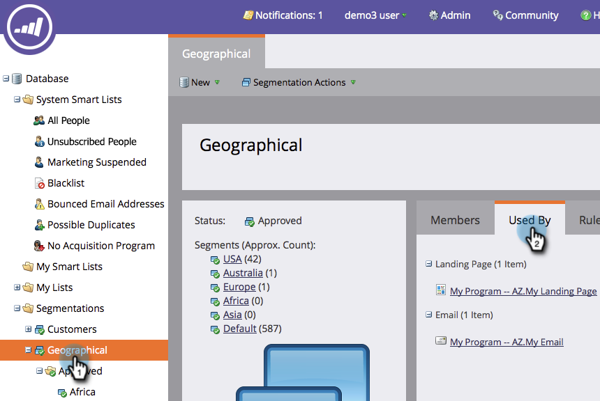
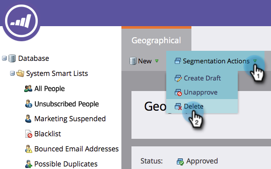

# Delete a Segmentation {#delete-a-segmentation}

A segmentation can be deleted by following the steps below.

1. Go to the **[!UICONTROL Database]**.

   

1. Go to your segmentation and click on **[!UICONTROL Used By]** to check associations.

   

   If your segmentation is used by other assets, remove all those associations before you proceed.

1. Remove all associations and then in **[!UICONTROL Segmentation Actions]** click **[!UICONTROL Unapprove]**.

   

   >[!NOTE]
   >
   >You can remove associations by deleting or creating alternatives for the assets that use the segmentation.

1. Once unapproved, click **[!UICONTROL Segmentation Actions]** and [!UICONTROL Delete] the segmentation.

   

That's it. You can't get it back, so make sure you don't need it anymore.
