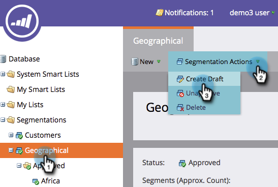
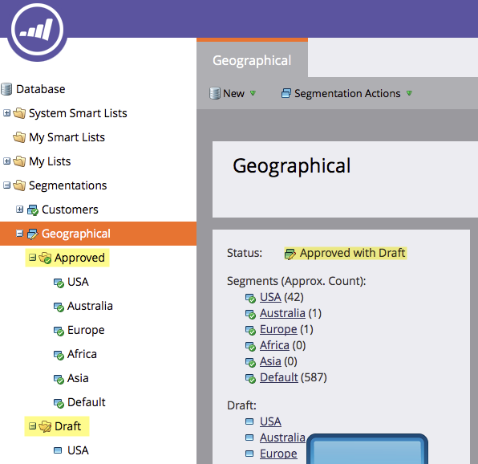

# Edit a Segmentation {#edit-a-segmentation}

Making changes to your existing segmentations is easy. Here's the low down.

## Create a Segmentation Draft {#create-a-segmentation-draft}

1. Go to the **Database**.

   

1. In your Segmentation, click on **Segmentation Actions** and then **Create Draft**.

   

1. The **Status **changes to Approved with Draft. A **Draft **folder is created in your segmentation.

   

## Add, Edit, or Delete Segments {#add-edit-or-delete-segments}

1. In your segmentation, click on **Segmentation Actions** and then **Edit Segments**.

   

   >[!NOTE]
   >
   >You can only Edit Segments of a Draft and not the Approved Segmentation.

1. **Add Segment**, **Edit **existing (rename or change the order) or **Delete **any Segments.

   

   >[!NOTE]
   >
   >You need to select a Segment before you can edit or delete it.

   >[!CAUTION]
   >
   >Deleting affects all associated Dynamic Content in Emails, Landing Pages, and Snippets. **There is no undo**. Check the **Used By** tab to see what uses that segment.

## Edit Segment Rules {#edit-segment-rules}

1. In your Draft **Segment**, go to **Smart List**. Apply rules similar to [Defining Segment Rules](http://docs.marketo.com/display/public/DOCS/Define+Segment+Rules).

   

   >[!NOTE]
   >
   >You cannot edit your Approved Segments. Click on Segments in Draft folder to edit them.

   >[!NOTE]
   >
   >**Reminder**
   >
   >
   >Remember to Approve your Segmentation Draft.

Feel free to experiment on segmentations that are not used in dynamic content.

>[!NOTE]
>
>**Related Articles**
>
>* [Delete a Segmentation](delete-a-segmentation.md)
>

