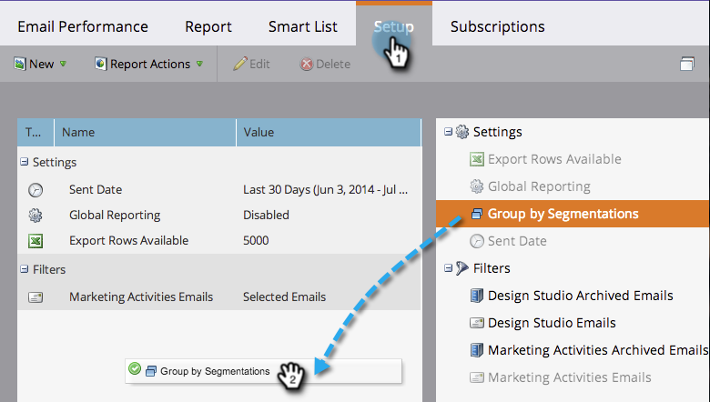
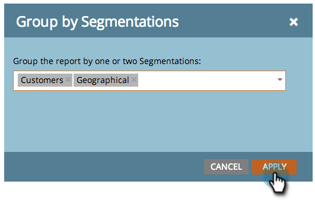
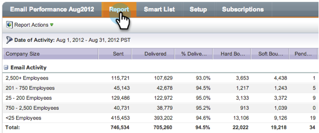

# Group Email Reports by Segmentations {#group-email-reports-by-segmentations}

Segmentations are not just for Dynamic Content. You can group your&nbsp; [email performance report](../../../../product-docs/email-marketing/email-programs/email-program-data/email-performance-report.md)&nbsp;by&nbsp; [segmentations](http://docs.marketo.com/display/docs/segmentation+and+snippets),&nbsp;too.

>[!NOTE]
>
>**Prerequisites**
>
>* [Approve a Segmentation](approve-a-segmentation.md)
>

1. Go to the **Marketing Activities** (or **Analytics**) area.

   

1. Select your **Email Performance** report.

   

1. Click the **Setup** tab and drag over **Group by Segmentations**.

   

1. Choose one or two segmentations to use for grouping your report. Click **APPLY**.

   

1. That's it! Click the **Report** tab. If you use one segmentation, your report shows one row for each segment.

   

1. If you use two segmentations, it shows one row for each *combination* of segments.

   

>[!NOTE]
>
>**Related Articles**
>
>* [Filter Assets in an Email Report](../../../../product-docs/reporting/basic-reporting/report-activity/filter-assets-in-an-email-report.md)
>

