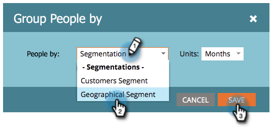

# Group Person Reports by Segment {#group-person-reports-by-segment}

You can group your person reports by any segment that you have  defined in your segmentations.

1. Go to **[!UICONTROL Marketing Activities]** (or **[!UICONTROL Analytics]**) section.

   

1. Select your person report from the navigation tree.

   

1. Click the **[!UICONTROL Setup]** tab and double-click **[!UICONTROL Group People by]**.

   

   >[!NOTE]
   >
   >You can also [group your person reports by person or company attribute](/help/marketo/product-docs/reporting/basic-reporting/report-activity/group-person-reports-by-attribute.md).

1. In the **[!UICONTROL Group People by]** dialog, start typing 'Segmentation' in the text box. When the **Segmentations** heading appears, select one from the list below the heading.

   

1. Click the **[!UICONTROL Report]** tab to see your report grouped by the selected segment.

   

>[!MORELIKETHIS]
>
>[Add Custom Columns to a Person Report](/help/marketo/product-docs/reporting/basic-reporting/editing-reports/add-custom-columns-to-a-person-report.md)
