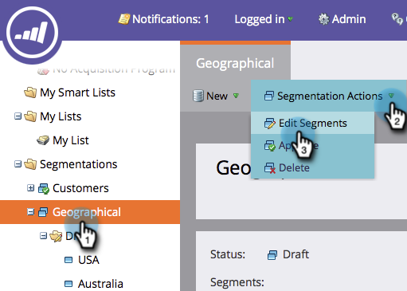
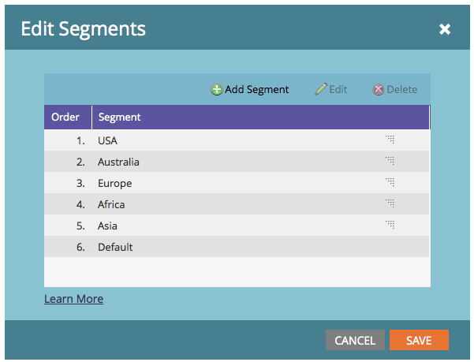

# Segmentation Order Priority {#segmentation-order-priority}

It is important to understand how **order** sets the priority for evaluation of your people in a segmentation.

>[!NOTE]
>
>**Prerequisites**
>
>* [Create a Segmentation](create-a-segmentation.md)
>* [Define Segment Rules](define-segment-rules.md)
>

1. Go to the **Database**.

   

1. Select your **Segmentation**. In **Segmentation Actions**, click **Edit Segments**.

   

   >[!NOTE]
   >
   >You can only edit a draft of your segmentation.

   You can check or edit the order of your segments from this screen.
   

>[!NOTE]
>
>* The segments are mutually exclusive.&nbsp;A person can be a member of&nbsp;only one&nbsp;Segment at a time.
>* When a person qualifies for two segments, they will belong only to the first one in the list.
>* If a person does not qualify for any Segment, they will become a member of the Default Segment.
>

Cool, huh? You can use segments for dynamic content, [reporting](http://docs.marketo.com/display/docs/basic+reporting) and even in [smart lists](http://docs.marketo.com/display/docs/smart+lists+and+static+lists).    

