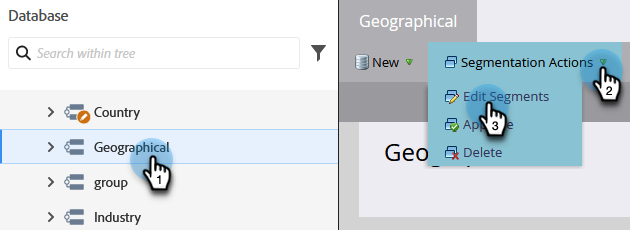

# Segmentation Order Priority {#segmentation-order-priority}

It is important to understand how **order** sets the priority for evaluation of your people in a segmentation.

>[!PREREQUISITES]
>
>[Create a Segmentation](/help/marketo/product-docs/personalization/segmentation-and-snippets/segmentation/create-a-segmentation.md)
>[Define Segment Rules](/help/marketo/product-docs/personalization/segmentation-and-snippets/segmentation/define-segment-rules.md)

>[!NOTE]
>
>You can only edit a segmentation in draft mode.

1. Go to the **Database**.

   

1. Select your **Segmentation**. In **Segmentation Actions**, click **Edit Segments**.

   

   You can check or edit the order of your segments from this screen.

   

>[!NOTE]
>
>* The segments are mutually exclusive. A person can be a member of only one Segment at a time.
>* When a person qualifies for two segments, they will belong only to the first one in the list.
>* If a person does not qualify for any Segment, they will become a member of the Default Segment.
