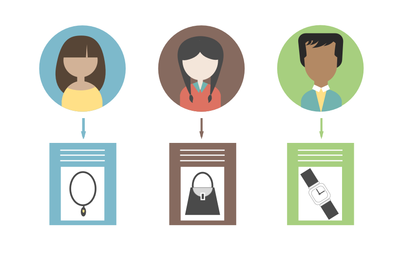
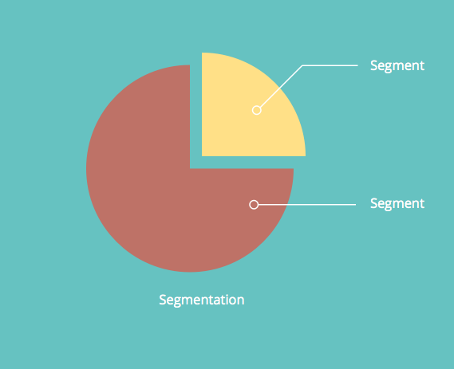
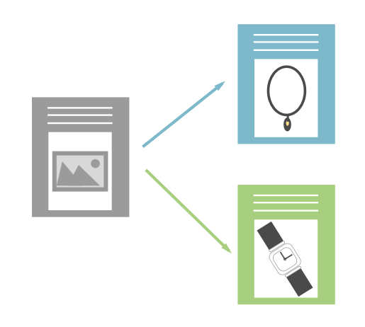

# Understanding Dynamic Content {#understanding-dynamic-content}

There is a lot more to personalization than just "Hi&nbsp;{{First Name}}". With Marketo dynamic content, you can customize how different people see a landing page or email.

>[!NOTE]
>
>**FYI**
>
>Marketo is now standardizing language across all subscriptions, so you may see lead/leads in your subscription and person/people in docs.marketo.com. These terms mean the same thing; it does not affect article instructions. There are some other changes, too. [Learn more](http://docs.marketo.com/display/DOCS/Updates+to+Marketo+Terminology).

#### Segmentation {#segmentation}

First, you'll need to divide up your people into subgroups. This is called [segmentation](create-a-segmentation.md).

>[!NOTE]
>
>**Definition**
>
>Segmentation categorizes your audience into different subgroups based on a [Smart List](../../../../product-docs/core-marketo-concepts/smart-campaigns/understanding-smart-campaigns.md)rule. These groups are called segments.

For example, if we have a segmentation called Industry, some of the segments could be: Healthcare, Technology, Financial, Consumer Goods etc.   

#### Dynamic Content {#dynamic-content}

Once you've created different segments, you can add dynamic content blocks into your landing page or email. This tells Marketo that you want that piece of content to be different depending on which person views it.

#### Snippets {#snippets}

[Snippets](../../../../product-docs/personalization/segmentation-and-snippets/snippets/create-a-snippet.md) are a useful tool in Marketo. Create it once, and use it in multiple places! If you update the snippet, all the assets (landing pages or emails) using the snippet will be automatically updated.&nbsp;

>[!NOTE]
>
>**Example**
>
>* You can use a snippet as a signature in an email. Dynamically change text depending on the recipient's location.
>* On landing pages, have a standard call-to-action area with different links for customers vs. prospects. Update hundreds of LPs centrally.
>

Try it out and tell us your success story!

>[!NOTE]
>
>**Related Articles**
>
>* [Create a Segmentation](create-a-segmentation.md)
>* [Create a Snippet](../../../../product-docs/personalization/segmentation-and-snippets/snippets/create-a-snippet.md)
>

