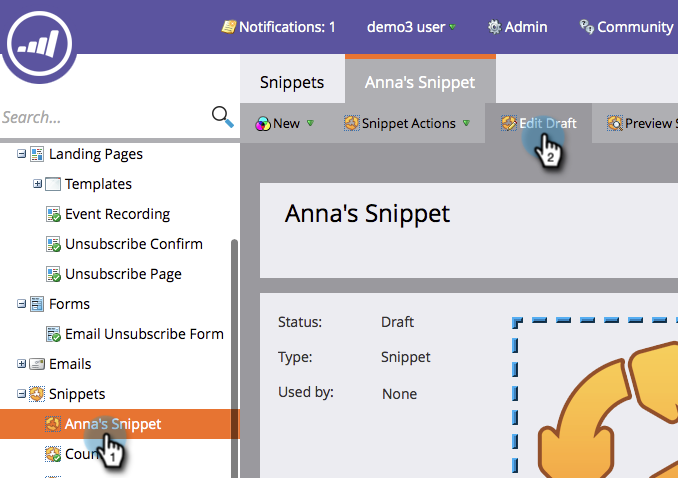
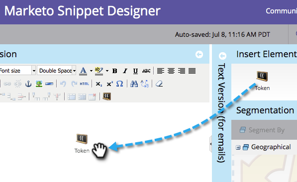
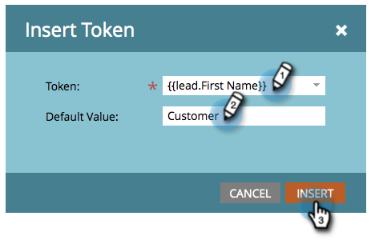
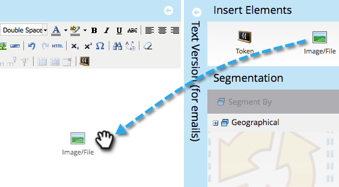
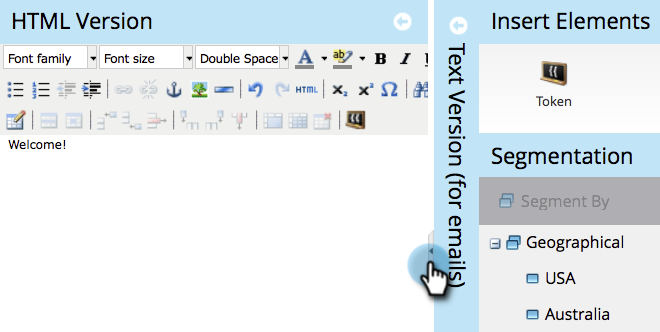
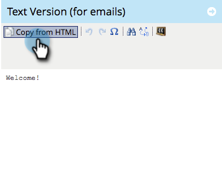

# Add Content to a Snippet {#add-content-to-a-snippet}

>[!NOTE]
>
>**Prerequisites**
>
>* [Create a Snippet](create-a-snippet.md)
>

You can add tokens, images, files or rich text to a snippet. 

>[!NOTE]
>
>You cannot embed any [Marketo email syntax](../../../../product-docs/email-marketing/general/email-editor-2-0/email-template-syntax.md)in snippets; it will **not** work in an email. Snippets should just be body content (HTML + TEXT).

1. Go to the** Design Studio.**

   

1. Select your **Snippet **and click **Edit Draft**.

   

You can add three types of content to a snippet.

## Add Token {#add-token}

1. Drag and drop the **Token **element.

   

1. Enter **Token **and click **Insert**.

   

## Add Image/File {#add-image-file}

1. Drag and drop the** Image/File** element.

   

   >[!NOTE]
   >
   >**Deep Dive**
   >
   >
   >You can add your own images or files to Marketo. Learn more about [images and files](http://docs.marketo.com/display/docs/images+and+files).

1. Select the **Image **to be used and click **Insert**.

   

   >[!NOTE]
   >
   >You can also search for a specific image if you know its name.

## Add Text {#add-text}

1. Type in the HTML Version area to add text.

   

   >[!TIP]
   >
   >Use the formatting tools to customize your text.

1. For Emails, click the **Text Version** tab.

   

1. Click **Copy from HTML**.

   

   >[!NOTE]
   >
   >Images, links, and formatting are removed in the Text Version.

Cool! Now you can create a variety of content for your Snippet.

>[!NOTE]
>
>**Related Articles**
>
>* [Preview a Snippet](preview-a-snippet.md)
>* [Approve a Snippet](approve-a-snippet.md)
>

