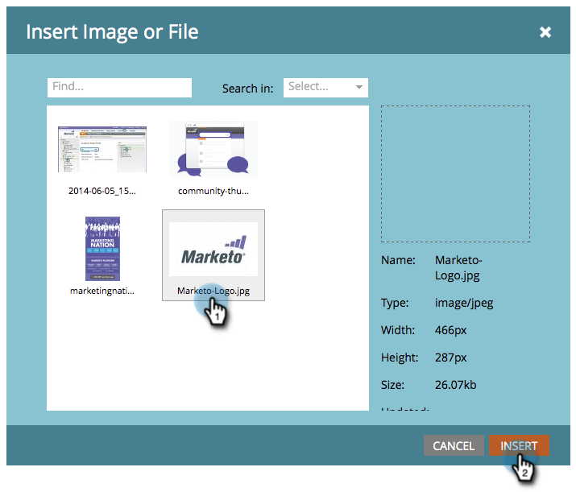

# Add Content to a Snippet {#add-content-to-a-snippet}

>[!PREREQUISITES]
>
>[Create a Snippet](/help/marketo/product-docs/personalization/segmentation-and-snippets/snippets/create-a-snippet.md)

You can add tokens, images, files or rich text to a snippet.

>[!NOTE]
>
>You cannot embed any [Marketo email syntax](/help/marketo/product-docs/email-marketing/general/email-editor-2/email-template-syntax.md) in snippets; it will **not** work in an email. Snippets should just be body content (HTML + TEXT).

1. Go to the **[!UICONTROL Design Studio]**.

   

1. Select your **Snippet** and click **[!UICONTROL Edit Draft]**.

   

You can add three types of content to a snippet.

## Add [!UICONTROL Token] {#add-token}

1. Drag and drop the **[!UICONTROL Token]** element.

   

1. Enter **[!UICONTROL Token]** and click **[!UICONTROL Insert]**.

   

## Add Image/File {#add-image-file}

1. Drag and drop the **[!UICONTROL Image/File]** element.

   

   >[!NOTE]
   >
   >You can add your own images or files to Marketo. Learn more about [images and files](/help/marketo/product-docs/demand-generation/images-and-files/add-images-and-files-to-marketo.md).

1. Select the **Image** to be used and click **[!UICONTROL Insert]**.

   

   >[!NOTE]
   >
   >You can also search for a specific image if you know its name.

## Add Text {#add-text}

1. Type in the HTML Version area to add text.

   

   >[!TIP]
   >
   >Use the formatting tools to customize your text.

1. For Emails, click the **[!UICONTROL Text Version (for emails)]** tab.

   

1. Click **[!UICONTROL Copy from HTML]**.

   

   >[!NOTE]
   >
   >Images, links, and formatting are removed in the Text Version.

Cool! Now you can create a variety of content for your Snippet.

>[!MORELIKETHIS]
>
>* [Preview a Snippet](/help/marketo/product-docs/personalization/segmentation-and-snippets/snippets/preview-a-snippet.md)
>* [Approve a Snippet](/help/marketo/product-docs/personalization/segmentation-and-snippets/snippets/approve-a-snippet.md)
