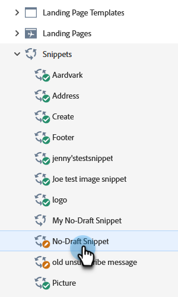
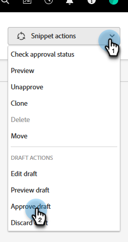
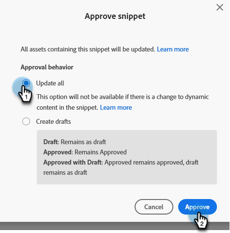

# Approve a Snippet with No-Draft {#approve-a-snippet-with-no-draft}

## Approve the Snippet {#approve-the-snippet}

No-Draft is triggered each time a snippet is approved. This includes a snippet that is shared or referenced by assets in other workspaces.

1. Go to the **[!UICONTROL Design Studio]**.

   

1. Find and select the desired snippet.

   

1. In the **[!UICONTROL Snippet actions]** drop-down, choose **[!UICONTROL Approve draft]**.

   

1. Select an option in the Approve snippet dialog box and click **[!UICONTROL Approve]**:

    * **[!UICONTROL Update all]**: This option will not create drafts of the approved assets using the snippet. All assets get the updates and maintain their prior statuses. A progress module appears on the top right side of the screen; it can be closed at any time. To restore it, right-click the snippet name and select Show Approval Status.
    * **[!UICONTROL Create drafts]**: This option will create drafts of the approved assets using the snippet. Select this option if snippet changes need to be reviewed first. All drafts must be approved manually.

   

   >[!NOTE]
   >
   >For a new snippet that's not used yet, this Approve Draft screen doesn't appear. It shows up when the snippet is used in one or more assets.

>[!CAUTION]
>
>This feature is designed to save time with the snippet approval workflow. However, there are a few limitations to be aware of. Please see [this article](https://nation.marketo.com/t5/knowledgebase/no-draft-snippet-limitations-and-troubleshooting/ta-p/300799){target="_blank"} for details.

>[!MORELIKETHIS]
>
>[Enable No-Draft for Snippets](/help/marketo/product-docs/administration/users-and-roles/enable-no-draft-for-snippets.md){target="_blank"}
