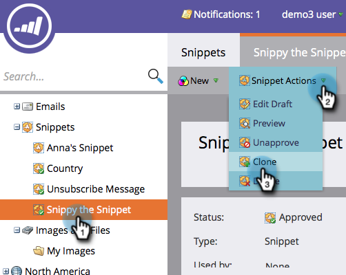
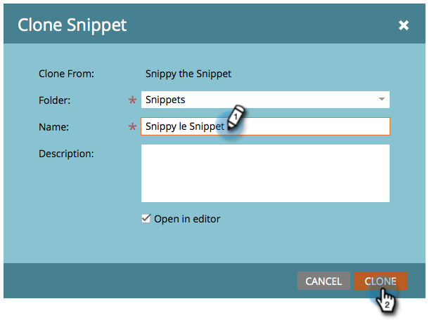

# Clone a Snippet {#clone-a-snippet}

Clone a snippet to create a copy of it that you can modify to your needs.

1. Go to the **[!UICONTROL Design Studio]**.

   

1. Go to your Snippet and then under **[!UICONTROL Snippet Actions]**, click **[!UICONTROL Clone]**.

   

1. Enter snippet details and click on **[!UICONTROL Clone]**.

   

Awesome! Now you can modify the cloned snippet to suit your needs.

>[!MORELIKETHIS]
>
>[Edit Snippets with Dynamic Content](/help/marketo/product-docs/personalization/segmentation-and-snippets/snippets/edit-snippets-with-dynamic-content.md)
