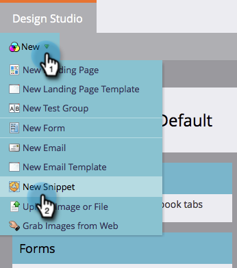

# Create a Snippet {#create-a-snippet}

Snippets can be used as dynamic content blocks on **emails** and **landing pages.**&nbsp;

1. Go to the **Design Studio.**

   

1. Click **New **and then **New Snippet**.

   

1. Enter the required details and click on **Create**.

   

Good work! Simplify your work by creating snippets for your dynamic content. Now you can go ahead and [add content to your new snippet](add-content-to-a-snippet.md).

>[!NOTE]
>
>**Related Articles**
>
>* [Add Content to a Snippet](add-content-to-a-snippet.md)
>* [Understanding Dynamic Content](../../../../product-docs/personalization/segmentation-and-snippets/segmentation/understanding-dynamic-content.md)
>

