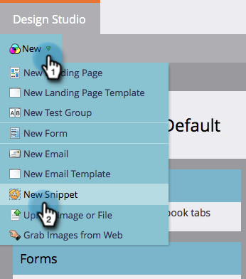

# Create a Snippet {#create-a-snippet}

Snippets can be used as dynamic content blocks on **emails** and **landing pages**.

1. Go to the **[!UICONTROL Design Studio]**.

   

1. Click **[!UICONTROL New]** and then **[!UICONTROL New Snippet]**.

   

1. Enter the required details and click on **[!UICONTROL Create]**.

   

Good work! Simplify your work by creating snippets for your dynamic content. Now you can go ahead and [add content to your new snippet](/help/marketo/product-docs/personalization/segmentation-and-snippets/snippets/add-content-to-a-snippet.md).

>[!MORELIKETHIS]
>
>* [Add Content to a Snippet](/help/marketo/product-docs/personalization/segmentation-and-snippets/snippets/add-content-to-a-snippet.md)
>* [Understanding Dynamic Content](/help/marketo/product-docs/personalization/segmentation-and-snippets/segmentation/understanding-dynamic-content.md)
