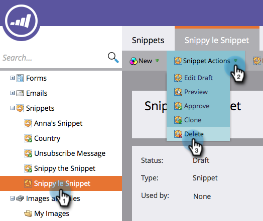

# Delete a Snippet {#delete-a-snippet}

>[!PREREQUISITES]
>
>[Unapprove a Snippet](/help/marketo/product-docs/personalization/segmentation-and-snippets/snippets/unapprove-a-snippet.md)

Delete a snippet that you don't need anymore.

1. Go to the **Design Studio**.

   

1. Go to your snippet and then under **Snippet Actions** click on **Delete**.

   

1. Click on **Delete** to confirm or just **Cancel**.

   

   >[!NOTE]
   >
   >You can only delete a snippet that is unapproved and not used by any assets.

Done! You cannot retrieve it, so be sure before you click the delete button.
