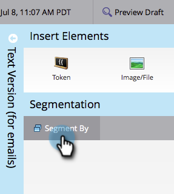
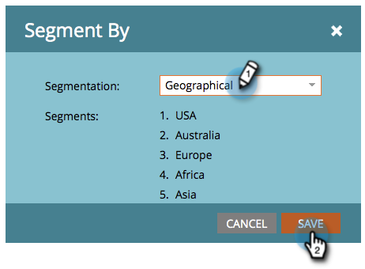
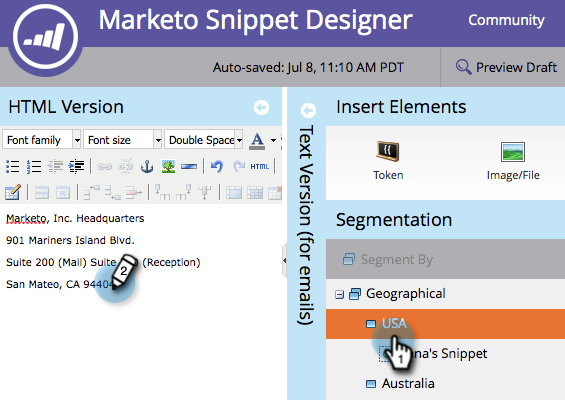

# Edit Snippets with Dynamic Content {#edit-snippets-with-dynamic-content}

>[!PREREQUISITES]
>
>* [Create a Segmentation](/help/marketo/product-docs/personalization/segmentation-and-snippets/segmentation/create-a-segmentation.md)
>* [Create a Snippet](/help/marketo/product-docs/personalization/segmentation-and-snippets/snippets/create-a-snippet.md)

Use Segmentation in Snippets to easily manage dynamic content on your emails and landing pages.

## Add Segmentation {#add-segmentation}

1. Go to the **Design Studio**.

   

1. Click on your **Snippet** and then **Edit Draft**.

   

1. Click on **Segment By**.

   

1. Enter **Segmentation** and click on **Save**.

   

## Apply Dynamic Content {#apply-dynamic-content}

1. Click on a **Segment** and then edit content. Repeat for each Segment

   

>[!NOTE]
>
>Remember to approve your Snippet before you use it.

Wasn't that simple? You are now all set to use these snippets on Emails and Landing Pages.

>[!MORELIKETHIS]
>
>* [Add a Snippet to an Email](/help/marketo/product-docs/email-marketing/general/functions-in-the-editor/add-a-snippet-to-an-email.md)
>* [Add a Snippet to a Landing Page](/help/marketo/product-docs/demand-generation/landing-pages/personalizing-landing-pages/add-a-snippet-to-a-landing-page.md)
