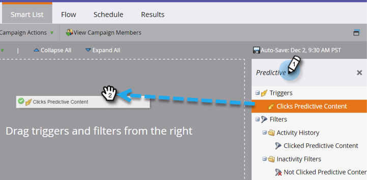
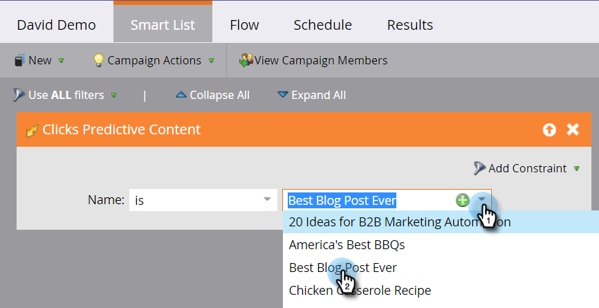
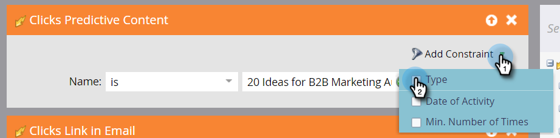

# Define a Smart List for Predictive Content Activities {#define-a-smart-list-for-predictive-content-activities}

You can use predictive content activities in triggers and filters when you define a smart list in a smart campaign. You can trigger an action for anyone who clicks predictive content via the [Rich Media template](/help/marketo/product-docs/predictive-content/enabling-predictive-content/enable-predictive-content-for-web-rich-media.md), the [Content Recommendation Bar](/help/marketo/product-docs/predictive-content/enabling-predictive-content/enable-the-content-recommendation-bar.md), or in an [email](/help/marketo/product-docs/predictive-content/enabling-predictive-content/enable-predictive-content-in-emails.md).

1. In your smart campaign, navigate to the **Smart List** tab.

   

   >[!NOTE]
   >
   >Smart lists can do amazing things. Learn more in the [smart list deep dive](/help/marketo/product-docs/core-marketo-concepts/smart-campaigns/understanding-smart-campaigns.md).

1. Search for the trigger and then drag and drop it onto the canvas.

   

   >[!NOTE]
   >
   >A smart campaign with triggers runs in Trigger mode. It runs on one person at a time based on events triggered and the filters added.

1. Click the **Name** drop-down and select an operator.

   

1. Define the trigger.

   

1. Add the **Type** constraint.

   

1. Select the source you need for your smart list.

   

1. If you're using the email source for your predictive content, add the **Clicks Link in Email** trigger. Select your email and add the **Is Predictive** constraint, defined as **true**.

   

1. Add any other filters as needed.

   

   >[!TIP]
   >
   >In a smart campaign with both triggers and filters, the triggers go at the top. When triggered, only people who satisfy the filter criteria go through the flow.

   >[!NOTE]
   >
   >With multiple triggers, a person goes through to the flow if ANY one of the triggers get activated.

   To run the campaign on a set of people all at the same time, learn how to [define a smart list for a batch smart campaign](/help/marketo/product-docs/core-marketo-concepts/smart-campaigns/creating-a-smart-campaign/define-smart-list-for-smart-campaign-batch.md).

   >[!MORELIKETHIS]
   >
   >* [Define Smart List for Smart Campaign | Batch](/help/marketo/product-docs/core-marketo-concepts/smart-campaigns/creating-a-smart-campaign/define-smart-list-for-smart-campaign-batch.md)
   >* [Add a Flow Step to a Smart Campaign](/help/marketo/product-docs/core-marketo-concepts/smart-campaigns/flow-actions/add-a-flow-step-to-a-smart-campaign.md)
   >* [Define a Smart List for Web Personalization Activities](/help/marketo/product-docs/web-personalization/working-with-web-campaigns/define-a-smart-list-for-web-personalization-activities.md)
   >* [Enable Predictive Content for Web Rich Media](/help/marketo/product-docs/predictive-content/enabling-predictive-content/enable-predictive-content-for-web-rich-media.md)
   >* [Enable the Content Recommendation Bar](/help/marketo/product-docs/predictive-content/enabling-predictive-content/enable-the-content-recommendation-bar.md)
