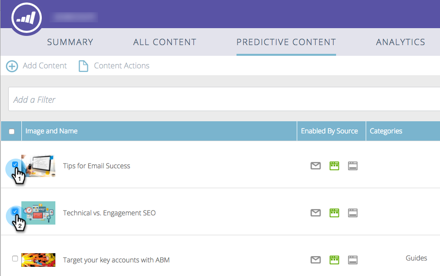
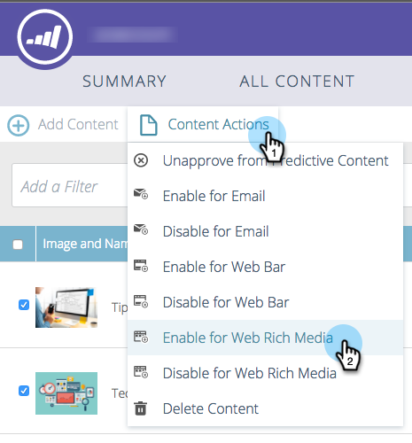
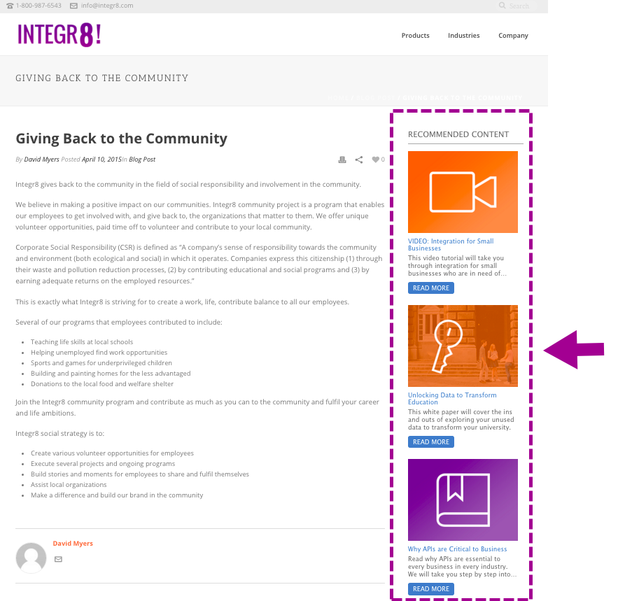

# Enable Predictive Content for Web Rich Media {#enable-predictive-content-for-web-rich-media}

Predictive content engages your web visitors with the most relevant content, powered by machine learning and predictive analytics. With Web Rich Media, you can enhance your content with text descriptions and images and embed multiple predictive content recommendations on your website.

>[!NOTE]
>
>It's recommended that you enable over five pieces of content per category and per source (email, rich media, bar) before testing and using Predictive Content. More content gives you a better predictive outcome.

>[!PREREQUISITES]
>
>Before enabling Predictive Content, you must:
>
>* **Prepare your Predictive Content**
>
>   * [Edit Predictive Content for Emails](/help/marketo/product-docs/predictive-content/working-with-predictive-content/edit-predictive-content-for-emails.md){target="_blank"} or
>   * [Edit Predictive Content for Rich Media](/help/marketo/product-docs/predictive-content/working-with-predictive-content/edit-predictive-content-for-rich-media.md){target="_blank"} or
>   * [Edit Predictive Content for the Recommendation Bar](/help/marketo/product-docs/predictive-content/working-with-predictive-content/edit-predictive-content-for-the-recommendation-bar.md){target="_blank"}
>
>* [Approve a Title for Predictive Content](/help/marketo/product-docs/predictive-content/working-with-all-content/approve-a-title-for-predictive-content.md){target="_blank"}

Once you've prepared the content title, description and image for Rich Media, you can enable individual or multiple content pieces.

1. To enable an individual title, click a title to open the editor. Click **[!UICONTROL Rich Media]**, then check the **[!UICONTROL Enabled for Predictive Content in Rich Media]** box and click **[!UICONTROL Save]**.

   

1. For multiple pieces of content, on the **[!UICONTROL Predictive Content]** page, check the boxes next to the title(s).

     

1. Click the **[!UICONTROL Content Actions]** drop-down and select **[!UICONTROL Enable for Web Rich Media]**.

   |

## Customize the Javascript Code and Embed it into your Website  {#customize-the-javascript-code-and-embed-it-into-your-website}

Refer to the documentation for the Rich Media Recommendation template [on the Marketo Developers site](https://developers.marketo.com/documentation/websites/rtp-rich-media-recommendations-api){target="_blank"}. This explains how to customize the template for your website.

Paste the JavaScript code into your website in the location where you want the template to appear.

**Template Examples**

* Template1: Three horizontal content pieces with images, header, and description
* Template2: Three vertical content pieces with images, header, and description

Here's an example of the Rich Media Recommendation Template1:

Here's an example of the Rich Media Recommendation Template2:

