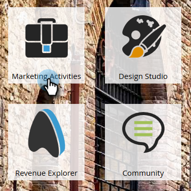
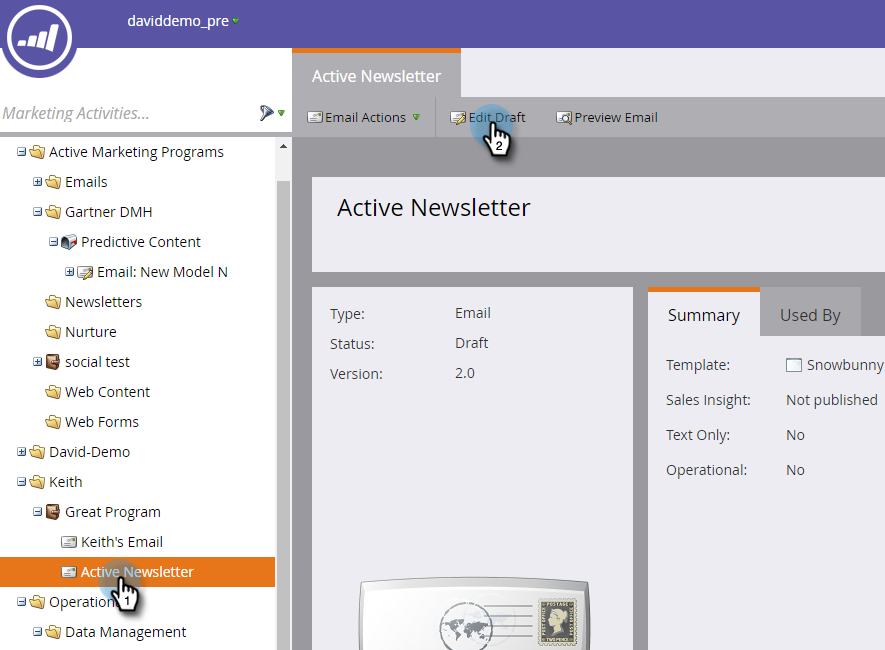
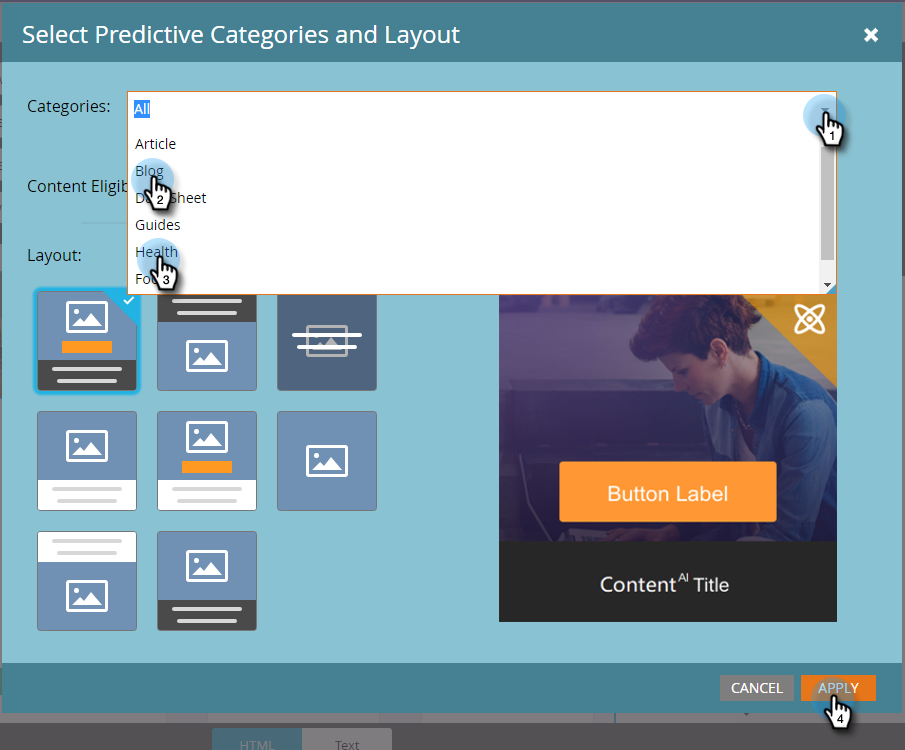
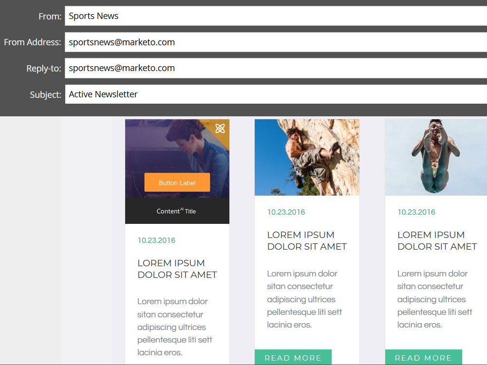
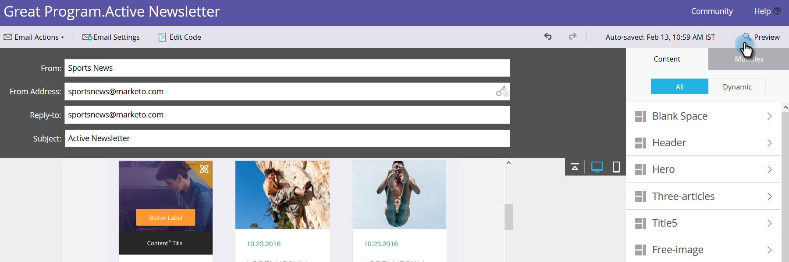

# Enable Predictive Content in Emails {#enable-predictive-content-in-emails}

Make one or more images in your email predictive, tailoring the experience for each recipient.

>[!NOTE]
>
>It's recommended that you enable over five pieces of content per category and per source (email, rich media, bar) before testing and using Predictive Content. More content gives you a better predictive outcome.

>[!NOTE]
>
>**Prerequisites**
>
>Before enabling Predictive Content. you must:
>
>* [Prepare your Predictive Content](http://docs.marketo.com/display/DOCS/Edit+Predictive+Content)
>* [Approve a Title for Predictive Content](http://docs.marketo.com/display/DOCS/Approve+a+Title+for+Predictive+Content)
>

## Adding Predictive Content Using the Email 2.0 Editor {#adding-predictive-content-using-the-email-editor}

1. Click **Marketing Activities**.

   

1. Select your email and click **Edit Draft**.

   

1. Click the image you want to make predictive. When the gear icon appears, click it and select **Enable Content`AI`** (Content`AI` is the former name for Predictive Content).

   

1. To select one or more categories, click the **Categories** drop-down, make your selection(s), and click **Apply**.

   

   >[!NOTE]
   >
   >Choosing specific categories or changing the predictive layout is optional.

1. Your image is now predictive. Repeat steps 3 and 4 for additional images (if desired).

   

1. To preview your email, click **Preview** in the upper-right corner.

   

1. To view different possible images, click **Refresh**.

   

   >[!NOTE]
   >
   >The image is not selected ***until the recipient opens the email***. So what you see in the preview is just an example, and will not necessarily be the image the recipient sees.

1. Once you're done previewing your email, click the **Preview Actions** drop-down and select **Approve and Close**. Or if you still have editing to do, click **Edit Draft** on the right.

   

   >[!NOTE]
   >
   >When sending a sample, a random image will be selected.

After you approve your email, it will be equipped with Predictive Content and ready to send! 

>[!CAUTION]
>
>Once a recipient opens the email, predictive images are locked. If the content is later removed, recipients will see a broken image where the content was.

## Adding Predictive Content When Not Using the Email 2.0 Editor {#adding-predictive-content-when-not-using-the-email-editor}

If you aren't using an [Email 2.0](http://docs.marketo.com/x/C4et) template, adding Predictive Content to your email can be done simply by tagging an image in your template as a Marketo editable image element.  
  
Learn about the [Marketo-specific syntax here](http://docs.marketo.com/display/DOCS/Email+Template+Syntax#EmailTemplateSyntax-Elements).   
  
Here is an example of what the code should look like (this is only an example, do not copy the code below exactly).

>[!NOTE]
>
>**Example**
>
>
  
>  
>
&nbsp;

