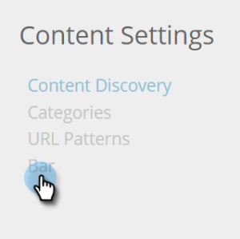
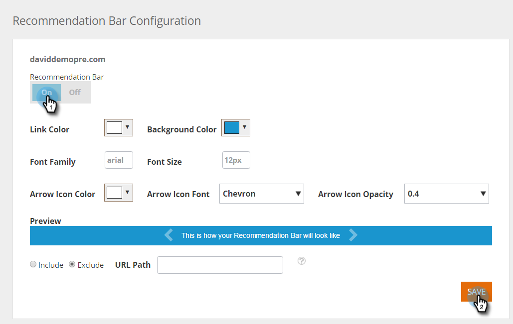
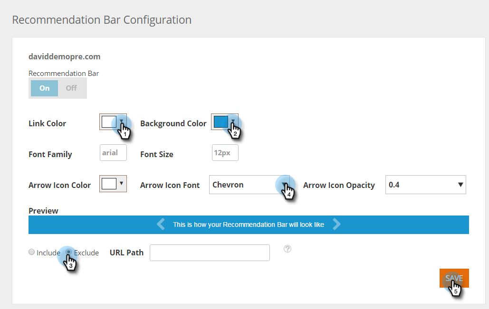

# Enable the Content Recommendation Bar {#enable-the-content-recommendation-bar}

The Content Recommendation Engine uses predictive analytics and machine learning algorithms to deliver relevant content to each web visitor. The recommendation engine predicts which content would perform best per visitor. The content for the engine is monitored and controlled under the Recommendations page, helping you optimize your content ROI.

>[!NOTE]
>
>**Prerequisites**
>
>Before enabling predictive content, you must:
>
>* [Prepare your Predictive Content](http://docs.marketo.com/display/docs/edit+predictive+content)
>* [Approve a Title for Predictive Content](/help/marketo/product-docs/predictive-content/working-with-all-content/approve-a-title-for-predictive-content.md)

## Enable and Customize the Content Recommendation Bar {#enable-and-customize-the-content-recommendation-bar}

1. Go to **Content Settings**.

   

1. Click **Bar**.

   

1. To enable the Recommendation Bar for a URL, simply click **On** and then **Save**.

   

1. To customize a URL, select colors, style, format, arrows for the recommendation bar, and pages to include or exclude the bar. Customize to fit your website branding. Click **Save**.

   

   >[!NOTE]
   >
   >**Include / Exclude Display URL**
   >
   >    * Display URL should be the path of the domain
   >    * Do not include http:// or https://
   >    * Use &#42; for wildcards
   >    * Use a semicolon as a separator
   >    * Example: /contact_us&#42;; &#42;action=logout&#42;
   >    * This field is case sensitive

## Recommendation Bar Considerations {#recommendation-bar-considerations}

* You need at least one content piece for the recommendation bar set to **On** on the Recommendations page for the Recommendation engine to work. If no content is enabled and the Bar is set to **On**, the Arrow effect will display on the bottom right of the webpage but no recommended content will appear.

* The more content running in the recommendation engine the better for the algorithm to test and learn which content works best. We recommend starting with 10 to 20 content pieces running and active and to keep adding new ones.
* The content piece you enable for recommendation should include the RTP Javascript tag. This helps the algorithm track and optimize recommended content.

>[!NOTE]
>
>**Related Articles**
>
>* [Enable Predictive Content for Web Rich Media](enable-predictive-content-for-web-rich-media.md)
