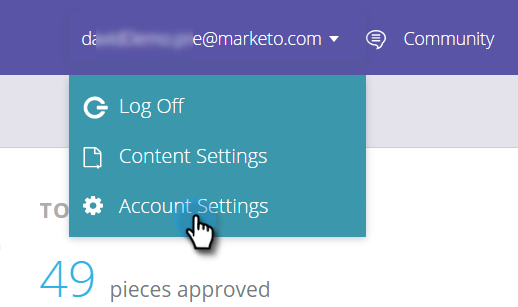

# Deploy the JavaScript for Content-AI {#deploy-the-javascript-for-content-ai}

>[!NOTE]
>
>Depending on the purchase date, your Marketo subscription may include either Marketo Predictive Content or Content`AI`. For those using Predictive Content, Marketo is enabling Content`AI` Analytics features until April 30, 2018. To keep these features beyond that date, please contact your Marketo Customer Success Manager to upgrade to Marketo Content`AI`.

To use Predictive Content, you need to generate and set up your the RTP (Web Personalization) `tag.`  

#### Generate Tag {#generate-tag}

1. Login to your Predictive Content account. Go to **Account Settings**.

   

1. In **Domain Configuration**, locate the relevant domain and click **Generate Tag.**

   

1. Copy and paste the Web Personalization tag into the HTML of your website.

   

   >[!NOTE]
   >
   >Copy the Web Personalization JavaScript tag and paste it as the first script in the header of your pages, between the <head> </head> tags. See more detailed [implementation instructions here](http://docs.marketo.com/display/docs/rtp+tag+implementation) [.](http://pages2.marketo.com/rtp-implementation.html)

1. Verify the tag appears on all pages, including landing pages and sub-domains. Check this by right-clicking on your  `website’s`&nbsp;page. Go to **View Page Source** in a web browser. Search: ‘RTP’.
1. Confirm that the Tag toggle set to **ON**.

