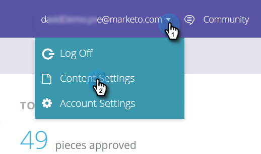

# Create Content Patterns {#create-content-patterns}

When you set content patterns, content is auto-discovered when a web visitor clicks on the HTML web page relevant to the content pattern. It's used to add HTML pages (blog posts, press releases, news articles) as content pieces to the All Content page. When auto-discovering is based on content patterns, it discovers and tracks HTML pages that are related to the defined URL pattern when a web visitor views or clicks a link to the page. This content piece (the URL, page name and meta data-including the image URL and description) is added to the All Content page to prepare predictive content. For auto-discovering other content, such as PDFs and embedded video, you need to [enable content discovery](/help/marketo/product-docs/predictive-content/getting-started/enable-content-discovery.md).

1. Go to **Content Settings**.

   

1. Click **URL Patterns**.

   

1. Click the **+** to open up a row where you can enter your information.

   

1. Add the URL extension of the domain where the web page exists. Select the category (for example, Blog, Article, Data Sheet, Press Release).

   

   >[!NOTE]
   >
   >Items in the drop-down list on the right reflect the categories you set up when you [created categories](/help/marketo/product-docs/predictive-content/getting-started/set-up-categories.md).

1. Click **+** to add another path.

   

1. Add the extension and catagory for the additional path and click **Save**.

   

## Content Pattern Rules {#content-pattern-rules}

* You can use a wildcard anywhere in an expression (Example: _domain.com/&#42;_, _domain.com/&#42;blog&#42;_)

* We recommend using /&#42; at the end of an expression to continue pattern discovery (Example: _domain.com/blog/&#42;_ discovers all posts in the Blog folder)
* Content patterns are not case sensitive (Example: _domain.com/Blog/&#42;_ discovers all html pages on _domain.com/Blog_ and _domain.com/blog_)

* URL parameters are not discovered (this avoids discovering multiple items with the same content URL but different parameters)

## Examples {#examples}

For _domain.com_:

<table> 
 <tbody> 
  <tr> 
   <th>URL Pattern</th> 
   <th>Result</th> 
  </tr> 
  <tr> 
   <td>blog/*</td> 
   <td>
Discovers all content that matches the pattern domain.com/blog/:

domain.com/blog/5-top-tricks

domain.com/blog/2017/new-year-solutions

domain.com/Blog/3-best-recipes
</td> 
  </tr> 
  <tr> 
   <td>article/2017/*</td> 
   <td>
Discovers all content that matches the pattern domain.com/article/2017/:

domain.com/article/2017/5-top-tricks
</td> 
  </tr> 
  <tr> 
   <td></td> 
   <td>
Discovers any URL that contains the word "datasheets:"

domain.com/datasheets/5-top-tricks

domain.com/blog/5-top-datasheets
</td> 
  </tr> 
  <tr> 
   <td>press-release</td> 
   <td>
Only one exact match HTML page is discovered:

domain.com/press-release
</td> 
  </tr> 
  <tr> 
   <td colspan="1"> </td> 
   <td colspan="1">
If the URL expression is empty, the URL pattern discovers only the home page:

domain.com
</td> 
  </tr> 
 </tbody> 
</table>
